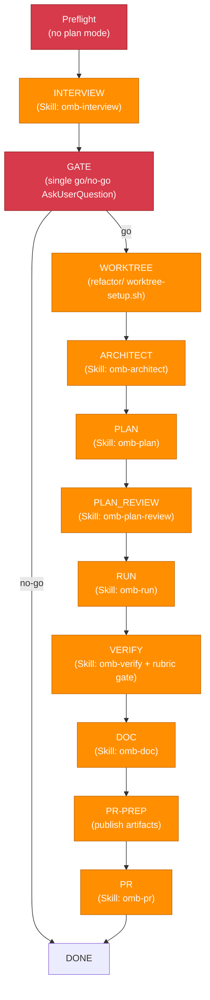

## Language Setting

Documentation language (`OMB_DOCUMENTATION_LANGUAGE`): !`bash .Codex/bin/omb-cli.sh env get OMB_DOCUMENTATION_LANGUAGE 2>/dev/null || echo en`

## Current Date

!`date +%Y-%m-%d`

# omb-refactoring — Autonomous Refactoring Pipeline

`omb-refactoring` drives the full lifecycle from a raw scope and goal to an open pull request:
`Preflight -> INTERVIEW -> GATE -> WORKTREE -> ARCHITECT -> PLAN -> PLAN_REVIEW -> RUN -> VERIFY -> DOC -> PR-PREP -> PR -> DONE`.
`PR-PREP` is an internal publish transition; the external-chain-compatible literal that stays
interoperable with `omb-goal`'s own chain is
`Preflight -> INTERVIEW -> GATE -> WORKTREE -> ARCHITECT -> PLAN -> PLAN_REVIEW -> RUN -> VERIFY -> DOC -> PR -> DONE`.

Most of the phase mechanics — `--bypass` semantics, the per-phase retry cap, the disagreement-consensus
classification, and the decision-log format — are single-sourced in
`.agents/skills/omb-goal/rules/pipeline-contract.md`. The delta this pipeline adds over `omb-goal`
(the `ARCHITECT` insertion, the fixed `refactor/` branch type, `--research` routing, the architect-artifact
handoff, and the VERIFY refactoring rubric gate) is single-sourced in
`.agents/skills/omb-refactoring/rules/refactoring-pipeline-contract.md`. This file cites both rather than
restating their literals.

Every phase transition goes through `Skill()`; the downstream phase skills (`omb-plan`, `omb-run`,
`omb-verify`, `omb-architect`, ...) fan out to domain agents internally. This skill calls `Agent()`
directly in exactly one place: the `VERIFY` refactoring rubric gate and its RF repair loop, which spawn
`@plan-evaluator` and the domain `*-implement` agents named in the plan.

## Preflight

Runs before any phase-skill call. Parse and strip flags, block plan mode, and bind the run-scoped
paths, in order:

0. **Parse and strip `--codex` and `--research`.** Strip both flags from the invocation string before
   slug derivation; set `codex_mode=true` and/or `research_mode=true` accordingly. This must happen
   before HARD rule #7's `slug` normalization and before the `INTERVIEW` invocation, so neither flag
   leaks into `slug`, the decision-log path, or the recorded `scope`/`goal` state variables.
1. **Plan-mode detection.** Inspect the system reminders for a plan-mode marker (a "Plan File Info"
   token injected by Claude Code while plan mode is active). If detected, emit `<omb>BLOCKED</omb>`
   and instruct the user to exit plan mode and re-run.
2. **Absolute path binding.** Ignore existing worktrees entirely; `WORKTREE` always creates a fresh
   one. Resolve the invocation root using the same Tier-1-first sequence `omb-goal`'s Preflight uses
   (`.Codex/rules/languages/shell.md`, "Project root resolution"), and bind the run-scoped decision
   log path under it (`{invocation root}/.omb/goal/{slug}-refactor-decisions.md`, re-keyed at
   `WORKTREE` once the final branch is known, mirroring `omb-goal`'s own re-key step).

Both the resolved invocation root and the decision-log path are recorded as literal absolute paths in
the active response and re-recorded at every phase transition (Token Budget Guard, below).

## HARD Rules

1. **[HARD] No conversation after GATE.** Same as `omb-goal` HARD rule #1 — `AskUserQuestion` is
   permitted only during `GATE` and inside `INTERVIEW`. No phase from `WORKTREE` through `PR` may
   prompt the user interactively.
2. **[HARD] Propagate `--bypass` to every downstream phase skill**, per
   `.agents/skills/omb-goal/rules/pipeline-contract.md` ("`--bypass` Semantics").
3. **[HARD] `--codex` reaches `PLAN` and `PLAN_REVIEW` only; `--research` reaches `ARCHITECT` only.**
   Routing table: `.agents/skills/omb-refactoring/rules/refactoring-pipeline-contract.md`. The
   delegation procedure `PLAN`/`PLAN_REVIEW` follow is documented at
   `.agents/skills/omb-codex/rules/codex-delegation.md` (documentation-only reference — this pipeline
   never runs the gate or `codex exec` itself).
4. **[HARD] Never enter plan mode.** Preflight pre-blocks; no later phase re-checks this.
5. **[HARD] Fresh `refactor/` worktree, never reused.** `WORKTREE` always creates one new worktree
   under a uniquified `refactor/` branch name. The pipeline never merges; its terminal success
   condition is an open pull request. Worktree teardown is `omb-pr` Step 4.6's concern, not this
   pipeline's.
6. **[HARD] Parse the `<omb>` tag from every phase's terminal output** to drive the state machine, per
   `.Codex/rules/common/output-contract.md`.
7. **[HARD] Normalize `slug` before first use**, exactly as `omb-goal` HARD rule #11 does — lowercase,
   hyphen-separated, per `.Codex/rules/git/branch-naming.md`. This must happen before `slug` is used
   in any shell command or filesystem path, including the `WORKTREE` branch argument and the
   `ARCHITECT` `--slug` argument.
8. **[HARD] Shell commands issued directly by this skill stay plain** — no `$()`, backtick, `<(`,
   `>(`, `<<`, or `for`/`while`/`cd`, per `.Codex/rules/workflow/12-subagent-bash-hygiene.md`.
9. **[HARD] English only** for all skill content and result envelopes, per
   `.Codex/rules/common/language-settings.md`.
10. **[HARD] Output contract** — end with `<omb>DONE|RETRY|BLOCKED</omb>` + result envelope per
    `.Codex/rules/common/output-contract.md`.
11. **[HARD] Sub-agent spawn bounding** follows `.Codex/rules/workflow/11-subagent-watchdog.md` for
    every fan-out the downstream skills (`omb-architect`, `omb-verify`'s Fix TODO execution) perform.
12. **[HARD] Ticket schema** — `RF-`/`CR-` prefixes follow `.Codex/rules/workflow/09-ticket-schema.md`.
13. **[HARD] Pin `name` to `subagent_type` on every direct `Agent()` spawn** (the `VERIFY` rubric gate
    and its repair loop), optionally with a `-<n>` numeric suffix for parallel duplicates
    (`api-implement`, `api-implement-2`). The PreToolUse payload carries this `name` as `agent_type`;
    a free-form label keeps `SubagentBashGateHandler` from resolving the agent's class, so a Class-A
    full deny degrades to the hygiene gate. SSOT: `.Codex/rules/workflow/12-subagent-bash-hygiene.md`.

## Token Budget Guard

Record these state variables as literal text after every phase transition, to survive context
compaction:

```
scope:                    {raw scope argument}
goal:                     {raw goal text, may be empty}
slug:                     {kebab-case slug derived from scope, then re-keyed at WORKTREE}
codex_mode:               {true or false}
research_mode:            {true or false}
invocation root:          {absolute path — primary checkout, set at Preflight}
decision log:             {absolute path — set at Preflight, re-keyed at WORKTREE}
interview summary:        {absolute path or NONE}
worktree_branch:          {branch or NONE}
worktree_path:            {absolute path or NONE, set at WORKTREE}
architect_file:           {absolute path or NONE, set at ARCHITECT}
inventory_file:           {absolute path or NONE, set at ARCHITECT}
plan_file:                {absolute path or NONE}
todo_file:                {absolute path or NONE}
pr_url:                   {url or PENDING}
current_phase:            {phase name}
retry_count[{phase}]:     {integer, per phase}
```

## Phase State Machine



### INTERVIEW

```
Skill("omb-interview") "{scope} {goal}"
```

Interactive by design, on the invocation checkout. Immediately after, capture the interview summary
absolute path with `ls -t .omb/interviews/*.md | head -1`.

### GATE

One `AskUserQuestion` call: present the interview summary and ask go/no-go, stating that no further
questions will be asked until the pull request is open. Decline (no-go) -> `<omb>DONE</omb>`, a
graceful end with no worktree created. Go -> proceed to `WORKTREE`.

### WORKTREE

Resolve a collision-free branch name with the fixed `refactor/` type, using the exact monotonic
collision ladder `omb-goal`'s WORKTREE step 1 uses (`{type}/{slug}`, `{type}/{slug}-2`, ...,
`{type}/{slug}-9`) — cite it rather than restating the ladder mechanics. Pin the resolved invocation
root exactly as `omb-goal`'s WORKTREE step 2 does, then invoke the setup script with the fixed
branch type:

```bash
CLAUDE_PROJECT_DIR=/abs/resolved/root bash /abs/resolved/root/.agents/skills/omb-worktree/scripts/worktree-setup.sh "refactor/{slug-or-suffixed}"
```

The command contains no `$`, backtick, or `cd`. Branch on the result per
`.Codex/rules/workflow/07-worktree-protocol.md`, exactly as `omb-goal`'s WORKTREE step 3 does: a
collision advances the ladder; any other `BLOCKED` reason, or ladder exhaustion, is terminal ->
`<omb>BLOCKED</omb>`. On `READY`, `cd` into the worktree path, record `worktree_branch` and
`worktree_path`, and re-key the decision log to
`{invocation root}/.omb/goal/{final-branch-slug}-refactor-decisions.md`.

### ARCHITECT

```
Skill("omb-architect") "--bypass --slug {slug} {scope} {goal} — interview summary: {interview summary}"
```

When `research_mode=true`:

```
Skill("omb-architect") "--bypass --slug {slug} --research {scope} {goal} — interview summary: {interview summary}"
```

`{slug}` here is the final branch slug `WORKTREE` resolved (the segment after `refactor/`, including
any ladder suffix), so a same-day rerun of the same goal never overwrites a previous run's design
artifact.

Compute the expected design document path as `.omb/architect/{date}-{slug}.md` using the same
`{date}` this pipeline was invoked on. Cross-check that path against the first `artifacts:` entry in
`omb-architect`'s result envelope; both must match, and the file must exist and be non-empty. On
mismatch, absence, or emptiness, retry `ARCHITECT` once; a second failure is `<omb>BLOCKED</omb>`.
Record `architect_file` as the confirmed absolute path and `inventory_file` as the sibling
`-inventory.json` artifact from the same envelope.

### PLAN

```
Skill("omb-plan") "--bypass {scope} {goal} — interview summary: {interview summary} — architect design: {architect_file}"
```

When `codex_mode=true`, insert `--codex` immediately after `--bypass`, mirroring `omb-goal`'s own
strip-order rule for the flag. The plan must include four refactoring-specific sections traced from
`architect_file`: measurable goal, target architecture, migration order, and behavior-preservation.
Immediately after, capture `plan_file` (absolute path, `ls -t .omb/plans/*.md | head -1`).

### PLAN_REVIEW

```
Skill("omb-plan-review") "--bypass {plan_file}"
```

Same as `omb-goal`'s PLAN_REVIEW phase — cite it rather than restating the codex-flag insertion point
and the residual-seam classification.

### RUN

```
Skill("omb-run") "--worktree --bypass {plan_file}"
```

Same as `omb-goal`'s RUN phase — cite it for the cwd-precedence caveat between this pipeline's
invocation root and `omb-run`'s own checkout root.

### VERIFY

```
Skill("omb-verify") "--bypass {plan_file}"
```

After `omb-verify` returns, the main session captures the implementation diff with four plain
commands, run in this exact order:

1. `git merge-base origin/main HEAD` — read stdout as `{merge_base_sha}`. If `origin/main` does not
   exist, use `git merge-base main HEAD`, then `git merge-base master HEAD` as fallbacks (same
   `main` -> `master` fallback order as `.Codex/rules/testing/test-execution.md`). Never wrap this in
   `$(...)`; the main session reads the tool output and substitutes the literal SHA.
2. `git add --intent-to-add .` — registers untracked files in the diff without staging content.
3. `git diff {merge_base_sha} > .omb/architect/{date}-{slug}-impl.diff` — captures the merge-base-relative
   working tree, including untracked files, into a literal absolute path.
4. `git reset -q` — a mixed reset that removes the intent-to-add index entries without touching the
   working tree, so `omb-pr` Step 4's `@git-commit` selective staging starts from a clean index.

An **absent or empty diff file is an RF-P0** — treat it as a fail-closed condition, never as an
empty-changeset pass. The RF repair loop below re-runs these same four steps to re-capture the diff.

Spawn `@plan-evaluator` as a critical background agent (per
`.Codex/rules/workflow/11-subagent-watchdog.md`). Substitute the main-session-resolved literal
absolute paths before issuing the call — the evaluator is Class A (Bash denied) per
`src/hook/security/subagent_bash_gate.py`, so it consumes all three inputs via `Read`:

```
Agent({
  subagent_type: "plan-evaluator",
  name: "plan-evaluator",
  run_in_background: true,
  prompt: "mode: post-implementation

Load the omb-evaluation-refactoring skill (its 'Dual Use' section names this mode) and score the
completed refactoring against all 6 rubric dimensions.

Inputs (absolute paths — read each with the Read tool):
- plan_file: {plan_file}
- architect_file: {architect_file}
- implementation diff: {impl_diff_file}   (the -impl.diff artifact captured above)

Consume the supplied diff file and the plan/design paths via Read; do not run git — the Ingest
step's git diff --name-only is replaced by the supplied diff file. Produce RF-P0..RF-P3 tickets per
.Codex/rules/workflow/09-ticket-schema.md and end with the <omb> tag and result envelope per
.Codex/rules/common/output-contract.md."
})
```

If the rubric run reports open `RF-P0`/`RF-P1` tickets, mirror
`.agents/skills/omb-verify/SKILL.md:442-569` Step 6-8: build a Fix TODO from the open tickets, group
by the domain `*-implement` agent named in the plan's Execution Structure, spawn each group
`run_in_background: true` in one message under the watchdog (each spawn pinned per HARD rule #13),
and after completion re-run the four diff-capture steps above and re-spawn `@plan-evaluator` for the
rubric gate. Each loop through this repair cycle consumes one `VERIFY` phase retry. Exhausting the retry cap with `RF-P0`/`RF-P1` still
open is always `(c)` **unrecoverable** — never `(a)`/`(b)` — matching `omb-goal`'s own EV-P0/EV-P1
VERIFY classification. The RF repair loop never re-invokes `omb-verify` itself.

### DOC

```
Skill("omb-doc") "--bypass {doc category or path derived from the goal}"
```

Same two BLOCKED-vs-continue outcomes as `omb-goal`'s DOC phase — cite it rather than restating them.

### PR-PREP

Publish every gitignored, worktree-only pipeline artifact into the invocation root's `.omb/`
directories: `plan_file`, the matching `.omb/todo/{...}.md` file, the interview summary,
`architect_file`, the architect inventory JSON, and the architect hotspots Markdown. For each
destination directory, first run a plain `mkdir -p /absolute/destination` with the literal absolute
path, then copy the source. When `WORKTREE` consumed a collision-ladder rung, append the `-{n}` rung
suffix to every destination filename's stem, exactly as `.agents/skills/omb-goal/SKILL.md:344-349`
does. Record every published absolute destination path in the decision log.

`omb-pr` Step 4.6 owns worktree teardown after the pull request is created; this pipeline does not execute `.agents/skills/omb-worktree/scripts/worktree-teardown.sh` itself — without this publish
step, those worktree-only artifacts would be lost when `omb-pr` tears the worktree down.

### PR

```
Skill("omb-pr") "--bypass"
```

Capture `pr_url`. Then run the Autonomous Decisions post-processing below.

## Autonomous Decisions PR Post-Processing

Same shape as `omb-goal`'s own post-processing — cite `.agents/skills/omb-goal/SKILL.md` for the
zero-decision fallback line, the attribution/language re-check, and the temp-file transfer mechanics.
Update the PR body via the GitHub REST API only; the GitHub CLI's PR-body-edit subcommand fails
against this repository's Projects-classic GraphQL setup:

```bash
gh api repos/{owner}/{repo}/pulls/{n} -X PATCH -F body=@{tempdir}/pr-body.md
```

`{owner}/{repo}` come from `git remote get-url origin`; `{n}` is the PR number extracted from
`pr_url`.

## Failure Policy

Retry cap, per-phase retry accounting, and the (a)/(b)/(c) disagreement-consensus classification are
all defined once in `.agents/skills/omb-goal/rules/pipeline-contract.md` — cite it, do not restate its
numbers or category list here. A `VERIFY` phase that ends with unresolved `RF-P0`/`RF-P1` findings
after the retry cap is exhausted MUST be classified `(c)` unrecoverable; `(a)`/`(b)` are not permitted
for it, mirroring `omb-goal`'s own EV-P0/EV-P1 rule.

## Error Cascade Table

| Phase | On Failure | Action |
|---|---|---|
| Preflight | Plan mode detected | `<omb>BLOCKED</omb>` (no worktree yet) |
| INTERVIEW | `omb-interview` BLOCKED | `<omb>BLOCKED</omb>` (no worktree yet) |
| GATE | User declines | `<omb>DONE</omb>` (graceful end, no worktree) |
| WORKTREE | Setup BLOCKED or ladder exhausted | `<omb>BLOCKED</omb>` |
| ARCHITECT | Inventory script exits 2 | `<omb>BLOCKED</omb>` (no agent spawned) |
| ARCHITECT | Design-document path mismatch/missing/empty, retry exhausted | `<omb>BLOCKED</omb>` |
| PLAN | Retry cap exhausted, `(c)` unrecoverable | `<omb>BLOCKED</omb>` + resume command |
| PLAN_REVIEW | Retry cap exhausted, `(a)`/`(b)` | Log to the decision log, continue |
| RUN | `omb-run` BLOCKED | `<omb>BLOCKED</omb>` + resume command |
| VERIFY | Retry cap exhausted with unresolved `RF-P0`/`RF-P1` — always `(c)` unrecoverable | `<omb>BLOCKED</omb>` + resume command |
| DOC | No doc target maps to changed files | Log disposition evidence, continue to PR |
| DOC | Target dirty / blockers unresolved | `<omb>BLOCKED</omb>` |
| PR | `omb-pr` BLOCKED | `<omb>BLOCKED</omb>` + resume command |

## Design Notes: Reachable Non-Skippable Seams

An audit of the chained skills identified five interactive or blocking seams that remain reachable
even under `--bypass`:

1. **Unseeded main-session plain commands may prompt.** `git merge-base`, `git add --intent-to-add`,
   `git diff`, `git reset -q`, `mkdir -p`, and `worktree-setup.sh` are plain commands issued by the
   main session; under `default` permission mode they can still surface a one-time approval prompt
   because no `settings.json` allowlist entry covers every exact invocation. This is a reachable seam
   documented in `.Codex/rules/harness/claude-code-harness.md` §7 (the Layer-1 seed allowlist) and
   the `mkdir` one-time-prompt precedent in `.agents/skills/omb-explain/SKILL.md`.
2. **`omb-plan` Step 0c ambiguity and 50/50 reviewer splits.** Passing the interview summary and
   `architect_file` into `PLAN` mitigates the common case; residual ambiguity is classified `(b)`
   quality-concern and logged rather than blocking.
3. **DOC's `omb-wiki` `USER_DECISION_REQUIRED`.** Per the fail-closed docs gates in
   `.agents/skills/omb-doc/SKILL.md` and `.agents/skills/omb-pr/SKILL.md`, an unresolved
   `USER_DECISION_REQUIRED` from `omb-wiki` is classified `(c)` unrecoverable and ends with
   `<omb>BLOCKED</omb>` — the same terminal disposition `omb-goal`'s DOC phase uses for
   blockers-unresolved.
4. **Class-B analysis-agent hygiene.** Every read-only Class-B analysis agent this pipeline's
   downstream skills spawn (via `omb-architect`, `omb-verify`'s Fix TODO reviewers) must follow the
   allow-grammar in `.Codex/rules/workflow/12-subagent-bash-hygiene.md`.
5. **`omb-plan` Step 1.7 architecture-reconciliation.** An `unresolved-conflict` P0 finding from
   `architecture-reconciliation` (`.agents/skills/omb-plan/SKILL.md`) is a seam reachable after
   `GATE`, requiring `AskUserQuestion`. `ARCHITECT`'s boundary/placement decisions feed `PLAN` to lower
   the odds of hitting it; a residual occurrence is classified `(c)` unrecoverable and ends with
   `<omb>BLOCKED</omb>`, exactly as `omb-goal` treats the same baseline seam.

## Output Contract

On success:

```
## Refactoring Pipeline Complete

**Scope:** {scope}
**Goal:** {goal}
**Pull request:** {pr_url}
**Plan:** {plan_file}
**Architect design:** {architect_file}
**Worktree:** {worktree_branch}
```

<omb>DONE</omb>

```result
summary: "Completed the autonomous refactoring pipeline for '{scope}' — pull request opened at {pr_url}."
artifacts:
  - "{pr_url}"
  - "{plan_file}"
  - "{architect_file}"
changed_files: []
concerns: []
blockers: []
retryable: false
next_step_hint: "Review the pull request, including the refactoring rubric gate result and any logged (a)/(b) classifications. Merge triggers omb-pr Step 4.6 worktree teardown."
```

On blocked:

<omb>BLOCKED</omb>

```result
summary: "{which phase failed and why}"
artifacts:
  - "{plan_file if it exists}"
  - "{architect_file if it exists}"
changed_files: []
concerns: []
blockers:
  - "{specific blocker}"
retryable: true
next_step_hint: "Resume manually with the standalone skill for the failing phase: {resume command}."
```

## See Also

- `.agents/skills/omb-goal/SKILL.md` and `.agents/skills/omb-goal/rules/pipeline-contract.md` —
  inherited phase mechanics.
- `.agents/skills/omb-refactoring/rules/refactoring-pipeline-contract.md` — the delta this pipeline
  adds over `omb-goal`.
- `.agents/skills/omb-architect/SKILL.md` — the analysis phase this pipeline inserts.
- `.agents/skills/omb-evaluation-refactoring/SKILL.md` — the VERIFY rubric gate.
- `.Codex/rules/workflow/11-subagent-watchdog.md`, `.Codex/rules/workflow/12-subagent-bash-hygiene.md`,
  `.Codex/rules/workflow/09-ticket-schema.md`, `.Codex/rules/common/output-contract.md`,
  `.agents/skills/omb-codex/rules/codex-delegation.md`.
