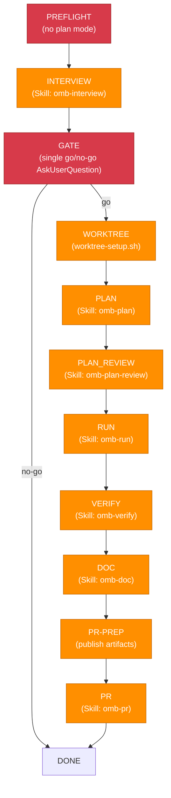

## Shared knowledge state

Follow `.claude/skills/omb-context/references/workflow-handoff.md`. Track downstream `knowledge_context`
bundle identities, evidence decisions, and unresolved knowledge dispositions in
phase handoffs. Do not add a duplicate mandatory search at goal level: interview,
plan, and run own scope-aware retrieval through the common manager.

## Language Setting

Documentation language (`OMB_DOCUMENTATION_LANGUAGE`): !`bash .claude/bin/omb-cli.sh env get OMB_DOCUMENTATION_LANGUAGE 2>/dev/null || echo en`

## Current Date

!`date +%Y-%m-%d`

# omb-goal — Autonomous End-to-End Pipeline

`omb-goal` drives the full lifecycle from a raw goal description to an open PR:
`PREFLIGHT -> INTERVIEW -> GATE -> WORKTREE -> PLAN -> PLAN_REVIEW -> RUN -> VERIFY -> DOC -> PR -> DONE`.
The full phase order, `--bypass` semantics, retry cap, disagreement-consensus
classification, and decision-log contract are single-sourced in
`.claude/skills/omb-goal/rules/pipeline-contract.md` — this file cites that contract
rather than restating its literals.

`allowed-tools` lists `Agent` only because the downstream phase skills (`omb-plan`,
`omb-run`, `omb-verify`, ...) fan out to domain agents internally. `omb-goal` itself
never calls `Agent()` directly — every phase transition goes through `Skill()`.

## PREFLIGHT

Runs before any phase-skill call. One parse step, one check, and one binding, in order:

0. **Parse and strip `--codex` / `--claude`.** These mutually exclusive selectors set
   `herdr_enabled=true` and `herdr_agent_kind=codex|claude`. Reject both selectors or unknown
   options before worktree or tab creation. Strip the selector from the recorded `goal`
   before slug derivation and INTERVIEW. With neither selector, keep the existing workflow.
   Selection implicitly enables Herdr; no separate `--herdr` flag is required.
   Only when `herdr_enabled=true`, read the preflight in
   `.claude/skills/omb-herdr/SKILL.md` before proceeding: require `HERDR_ENV=1`,
   installed Herdr and the selected CLI, and supported full-permission native arguments.
   Missing Herdr or selected-kind capability is BLOCKED. The shared Claude launcher
   tries TeamClaude first and permits only its bounded native-Claude fallback.
   Bind `HERDR_RESULT_CONTRACT` to
   `.claude/skills/omb-herdr/references/result-contract.md` and read it for every handoff.
   Bind HERDR_REVIEW_SKILL=`omb-herdr-review`, HERDR_VERIFY_SKILL=`omb-herdr-verify`,
   HERDR_MANAGEMENT_SKILL=`omb-herdr`, PLAN_REVIEW_SKILL=`omb-plan-review`, and
   VERIFY_SKILL=`omb-verify` for the substage contract. These names follow the active host's
   exported skill names.
   When no selector is present, skip all Herdr environment/CLI checks and do not create
   a Herdr state artifact; flagless goal works outside Herdr as before.
1. **Plan-mode detection.** Inspect the system reminders for a plan-mode marker (a "Plan
   File Info" token injected by Claude Code while plan mode is active). If plan mode is detected, emit <omb>BLOCKED</omb> and instruct the user to exit plan mode and re-run.
2. **Absolute path binding.** PREFLIGHT ignores existing worktrees entirely; the WORKTREE phase always creates a fresh worktree. Resolve and record:
   - `INVOCATION_PROJECT_ROOT` — resolve with the full Tier-1-first semantics of `.claude/rules/languages/shell.md` ("Project root resolution"), in this order:
     1. Run the plain command `printenv CLAUDE_PROJECT_DIR`. If it prints a non-empty path and that directory contains a `.claude` directory, that path IS `INVOCATION_PROJECT_ROOT` — use it verbatim. Tier 1 is contractual trust: an explicit override wins even when it names a linked worktree, because `worktree-setup.sh:51-53` and `src/hook/core/contract.py:27-30` both honour it first and the pipeline must agree with them.
     2. Otherwise run the plain command `git rev-parse --git-common-dir`; read its output and derive the primary root model-side — a relative `.git` means the current checkout is the primary root, an absolute `.../.git` means the primary root is its parent directory. Never `--show-toplevel`: inside a linked worktree it returns that worktree.
     Do not wrap either command in `$(...)`. PR-PREP always publishes under this resolved root regardless of the invocation cwd, and the WORKTREE phase pins `worktree-setup.sh` to this same root (see WORKTREE below), so exactly one root and one `.omb/db/worktrees.db` are in play for the whole run.
   - `DECISION_LOG` = `{INVOCATION_PROJECT_ROOT}/.omb/goal/{slug}-decisions.md`. Re-keyed at WORKTREE once the final branch is known (see WORKTREE step 4).

Both `INVOCATION_PROJECT_ROOT` and `DECISION_LOG` are recorded as literal absolute paths in
the active response and re-recorded at every phase transition (Token Budget Guard, below) so
they survive context compaction.

## HARD Rules

1. **[HARD] No conversation after GATE.** `AskUserQuestion` is permitted only during
   GATE and inside the `INTERVIEW` phase itself (which is interactive by
   design). No phase from WORKTREE through PR may prompt the user interactively.
2. **[HARD] Propagate `--bypass` to every downstream phase skill.** Next-step-prompt suppression
   across the whole chain is the entire point of this pipeline, not just at the entry point, so
   `--bypass` keeps flowing to every chained skill instead of being stripped before the first
   downstream call. See `.claude/skills/omb-goal/rules/pipeline-contract.md` ("`--bypass` Semantics").
3. **[HARD] Selectors require separate Herdr review and verification.** Follow
   `rules/herdr-stages.md` within PLAN_REVIEW and VERIFY. Do not propagate the raw selector
   to PLAN authoring or the existing PLAN_REVIEW invocation. Existing Evaluation must pass
   before Herdr Plan review; amendments do not restart Evaluation. Existing Verify must
   complete before Herdr Verify. Same-host selection still delegates to a new tab.
   Legacy `.claude/skills/omb-codex/rules/codex-delegation.md` fallback/no-op rules do not
   apply to this selected path. All transitions, including amendments, use `Skill()`.
4. **[HARD] Never enter plan mode.** PREFLIGHT pre-blocks; no later phase re-checks this.
5. **[HARD] Fresh-worktree contract.** Existing worktrees are ignored at PREFLIGHT; exactly one
   NEW worktree is created at WORKTREE under a uniquified branch name and is bound explicitly
   for the remainder of the run. The pipeline never merges — its terminal success condition is
   an open PR. Worktree teardown is owned by `omb-pr-watch` on a successful watch, or by
   `omb-pr` Step 6 on the legacy path (probe failure) — never by `omb-goal` itself.
6. **[HARD] Parse the `<omb>` tag from every phase's terminal output** to drive the state
   machine, per `.claude/rules/common/output-contract.md`.
7. **[HARD] Retry cap and disagreement-consensus classification are defined once** in
   `.claude/skills/omb-goal/rules/pipeline-contract.md` — do not restate the numeric cap or
   the (a)/(b)/(c) classification scheme here.
8. **[HARD] Shell commands issued directly by this skill stay plain** — no `$()`, `` ` ``,
   `<(`, `>(`, `<<`, or `for`/`while`/`cd` — per
   `.claude/rules/workflow/12-subagent-bash-hygiene.md`. This skill's own bash blocks carry
   no project-root fallback at all: PREFLIGHT resolves the root by reading `printenv` /
   `git rev-parse` output, and WORKTREE writes the resolved path out literally.
9. **[HARD] English only** for all skill content and result envelopes, per
   `.claude/rules/common/language-settings.md`.
10. **[HARD] Output contract** — end with `<omb>DONE|RETRY|BLOCKED</omb>` + result envelope
   per `.claude/rules/common/output-contract.md`.
11. **[HARD] Normalize `slug` before first use.** Derive `slug` from the goal text and
    normalize it to match `^[a-z0-9]+(-[a-z0-9]+)*$` (lowercase, hyphen-separated; strip
    everything else — spaces, punctuation, uppercase, non-ASCII) per
    `.claude/rules/git/branch-naming.md`. This normalization MUST happen before `slug` is
    used in any shell command or filesystem path, including the WORKTREE phase's
    `worktree-setup.sh "{type}/{slug}"` branch argument and the PREFLIGHT-recorded
    `DECISION_LOG` path.

## Token Budget Guard

Record these state variables as literal text after every phase transition, to survive
context compaction:

```
goal:                     {raw goal description}
slug:                     {kebab-case slug derived from the goal}
INVOCATION_PROJECT_ROOT:  {absolute path — primary checkout, set at PREFLIGHT}
DECISION_LOG:             {absolute path — set at PREFLIGHT}
INTERVIEW_SUMMARY:        {absolute path or NONE}
worktree_branch:          {branch or NONE}
worktree_path:            {absolute path or NONE, set at WORKTREE}
plan_file:                {absolute path or NONE}
todo_file:                {absolute path or NONE}
pr_url:                   {url or PENDING}
current_phase:             {phase name}
retry_count[{phase}]:     {integer, per phase}
herdr_enabled:           {boolean}
herdr_agent_kind:        {codex|claude|NONE}
herdr_state_file:        {absolute path or NONE; rules/herdr-stages.md}
herdr_substage:          {persisted substage or NONE}
```

## Phase State Machine



### INTERVIEW

```
Skill("omb-interview") "{goal}"
```

Interactive by design — the interview runs on the invocation checkout, whatever it is; the
pipeline has not created its worktree yet. Immediately after it completes:

```bash
ls -t .omb/interviews/*.md | head -1
```

Record `INTERVIEW_SUMMARY` as the absolute path to that file.

### GATE

One `AskUserQuestion` call: present the interview summary and ask go/no-go, stating that no
further questions will be asked until the PR is open. Decline (no-go) → `<omb>DONE</omb>`,
a graceful end with no worktree created. Go → proceed to WORKTREE.

### WORKTREE

1. **Resolve a collision-free branch name.** Run:

```bash
git branch --list "{type}/{slug}*"
```

Read that output and compare **whole branch names**, not prefixes: `{type}/{slug}-extra` is a
different branch and does not block `{type}/{slug}`.

Pick the first free branch name in the sequence `{type}/{slug}`, `{type}/{slug}-2`, `{type}/{slug}-3`, ... before calling `worktree-setup.sh`; an exact-name match in the branch list, an `already-registered` note, and a collision-classified `cli-failed` BLOCKED all advance the same sequence, which stops after `{type}/{slug}-9`.

The sequence is a single monotonically-advancing cursor: a pre-check skip and a collision
retry each move it forward by exactly one position, and it is never re-scanned from the
start. Keep the whole branch name at or under 50 characters per
`.claude/rules/git/branch-naming.md`; truncate the slug before appending the suffix, then
strip any trailing `-` left by the truncation. Every candidate MUST match
`^(feat|fix|refactor|test|docs|chore|ci|perf|style|build)/[a-z0-9]+(-[a-z0-9]+)*$` and be at
most 50 characters before it is passed to the script — a candidate that does not is a
construction bug, not a ladder rung, and MUST be repaired rather than skipped.

2. **Create the worktree, pinned to the PREFLIGHT-resolved root.** Write
`INVOCATION_PROJECT_ROOT` out as a literal absolute path in both positions:

```bash
CLAUDE_PROJECT_DIR=/abs/resolved/root bash /abs/resolved/root/.claude/skills/omb-worktree/scripts/worktree-setup.sh "{type}/{slug-or-suffixed}"
```

The literal env assignment makes the script's own Tier 1
(`worktree-setup.sh:51-53`) resolve to exactly the root this pipeline recorded, so the
worktree, the `.omb/db/worktrees.db` it writes, and the PR-PREP destination are the same
root in every configuration. The command contains no `$`, no backtick, and no `cd`.

3. **Branch on the result.** Follow `.claude/rules/workflow/07-worktree-protocol.md`.
`WORKTREE_STATUS=READY` → `cd {WORKTREE_PATH}`, record `worktree_branch` and `worktree_path`.

A `WORKTREE_NOTE=already-registered` result, or a `WORKTREE_STATUS=BLOCKED` whose `WORKTREE_REASON` starts with `cli-failed` and reports that the branch already exists, is a collision — advance to the next numeric suffix instead of terminating; never reuse an already-registered worktree.

Any other `WORKTREE_STATUS=BLOCKED` reason is terminal → `<omb>BLOCKED</omb>` with
`WORKTREE_REASON`. Exhausting the sequence through `{type}/{slug}-9` is also terminal →
`<omb>BLOCKED</omb>` stating that all nine candidates for this slug are consumed and that the
user should re-run with a different goal phrasing so a different slug is derived.

4. **Re-key the run-scoped artifacts to the final branch.** Let `{final-branch-slug}` be the
segment after `{type}/` in `worktree_branch`. Set
`DECISION_LOG = {INVOCATION_PROJECT_ROOT}/.omb/goal/{final-branch-slug}-decisions.md`. If
PREFLIGHT already created the file under the unsuffixed slug, move it to the new path and
append a `## D-{NNN}` entry recording the rename. Re-record `DECISION_LOG` in the Token
Budget Guard block. This keeps the decision log keyed to the same identity as
`worktree_branch`, so a same-day rerun of the same goal never overwrites the previous run's
log.

> **Observed `WORKTREE_REASON` string.** `worktree-setup.sh:154-156` combines the CLI call's
> output with `2>&1` and appends `tail -1`, so the trailing line is not the last line of
> stdout but the **BLOCKED message carried on stderr**. `src/hook/worktree/setup.py:46-50`
> wraps it as `[worktree] BLOCKED: {exc}`, and the original message is
> `src/hook/db.py:92`'s `worktree already exists for branch: {branch}`, so the actual observed
> string is `cli-failed: [worktree] BLOCKED: worktree already exists for branch: {branch}`.
> Judge this with a 2-condition partial match — the `cli-failed` prefix **and** wording that the
> branch already exists — not a fixed-string comparison.
> `git branch --list "{type}/{slug}*"` contains no `$`, backtick, or `cd`, so it satisfies
> SKILL.md HARD #7's plain-command requirement as-is. Do not wrap it in `$(...)`.
> **Intentionally narrow points (accepted risk).**
> - The already-registered ladder rung is belt-and-suspenders for a race the pre-check cannot
>   catch — `worktree-setup.sh:141-146`'s idempotency probe only fires when the branch is
>   already registered in git, and that case is already caught by the pre-check.
> - Only `cli-failed` messages satisfying both conditions above advance the ladder. Every other
>   git-conflict reason (e.g. a stray leftover worktree directory), even one that looks
>   recoverable, is terminal — this is a deliberate narrowing so a real failure is not absorbed
>   into an infinite retry.
> - Concurrent `omb-goal` runs in the same checkout are out of contract. If two runs race the
>   same candidate, the later one advances one more rung via collision classification, but no
>   lock enforces this.
> - If `worktree-setup.sh` creates the git worktree but the DB insert then fails, an orphaned
>   worktree is left behind (`src/hook/db.py:96` → `:113-118`). This is existing script/`db.py`
>   behavior and both are out of scope for this change — noted here only as an upstream issue
>   candidate.

### PLAN

```
Skill("omb-plan") "--bypass {goal} — interview summary: {INTERVIEW_SUMMARY, absolute path}"
```

Herdr selection does not change this authoring call.

Immediately after, capture `plan_file` (absolute path, `ls -t .omb/plans/*.md | head -1`).
`omb-plan` records `--status PLAN --plan {plan_file}` in the worktree DB — this is the
record `RUN` matches against when it auto-discovers the active worktree.

### PLAN_REVIEW

```
Skill("omb-plan-review") "--bypass {plan_file}"
```

When Herdr is selected, follow `rules/herdr-stages.md` stages 1–2: repeat this existing
review/evaluation until passing, then invoke the separate Herdr Plan review. Apply any
required findings through the narrow amendment mode, without re-evaluation or automatic
Herdr Plan re-review. Persist the final Plan digest before RUN.

Always pass the explicit `plan_file` path — never invoke without an argument. Design note:
`omb-plan-review`'s no-argument path falls back to interactive plan selection, which is a
reachable non-skippable seam under autonomous execution; passing the explicit path avoids
it entirely. A 50/50 reviewer split or a plan-evaluator P0/P1 that `PLAN_REVIEW` cannot
resolve within the shared retry cap is classified per the disagreement-consensus scheme in
the pipeline contract. On the flagless path residual quality concerns may be logged and
continued. On the selected Herdr path, required Evaluation failure cannot degrade to a
quality concern: stop BLOCKED before Herdr review or RUN.

### RUN

```
Skill("omb-run") "--worktree --bypass {plan_file}"
```

`--worktree` avoids `omb-run`'s own entry-confirmation prompt; Step 6 of `omb-run`
auto-resolves to the keep path under `--bypass`, staying inside the no-conversation-after-
GATE rule. **Variable distinction (important):** after Step 6 keep, `omb-run`'s cwd returns
to `omb-run`'s own `INVOCATION_CHECKOUT_ROOT` — which in this pipeline IS the worktree
created at the WORKTREE phase — NOT `omb-goal`'s `INVOCATION_PROJECT_ROOT` (the primary
checkout recorded at PREFLIGHT). These are two distinct variables belonging to two
different skills. Later phases run inside the pipeline worktree: VERIFY and DOC resolve it
through the CWD-precedence rule in `omb-worktree` `context`, which stays deterministic even
when other worktrees are active, while PLAN_REVIEW performs no worktree discovery at all
because `omb-goal` passes it an explicit `plan_file` path.

### VERIFY

```
Skill("omb-verify") "--bypass {plan_file}"
```

Always pass the explicit `plan_file` path, for the same no-argument-fallback reason as
PLAN_REVIEW.

When Herdr is selected, complete this existing verification first, then follow
`rules/herdr-stages.md` stages 4–6 for separate Herdr Verify and bounded remediation.
Do not enter DOC or PR while either required verification is incomplete.

### DOC

```
Skill("omb-doc") "--bypass {doc category or path derived from the goal}"
```

A doc target is required — `omb-doc` needs a concrete category or path, not a bare
`--bypass`. Two distinct BLOCKED-vs-continue outcomes:

- **No mapping exists.** If no doc target maps to the changed files, record the disposition
  evidence `docs N/A — no doc target maps to the changed files` in the decision log and
  continue to PR. This evidence feeds `omb-pr` Step 0.7's documentation evidence gate.
- **Target dirty or blockers unresolved.** Classify as (c) unrecoverable per the pipeline
  contract and emit `<omb>BLOCKED</omb>`.

### PR-PREP

Copy each gitignored pipeline artifact that only exists inside the worktree — `plan_file`,
the matching `.omb/todo/{...}.md` file, and `INTERVIEW_SUMMARY` if it was consumed from a
worktree-relative path — into `{INVOCATION_PROJECT_ROOT}/.omb/plans/`,
`{INVOCATION_PROJECT_ROOT}/.omb/todo/`, and `{INVOCATION_PROJECT_ROOT}/.omb/interviews/`.
Write both the source and the destination as literal absolute paths and never `cd` out of
the pipeline worktree — the copy must not change the working directory, because every
post-WORKTREE `Skill()` phase is invoked with cwd inside the pipeline worktree and the
downstream CWD-precedence rule depends on that.

Destination filenames: when the WORKTREE phase consumed a ladder rung (`{final-branch-slug}`
differs from the unsuffixed `{slug}`), append `-{n}` — the rung number from the branch name —
to the stem of each destination filename. Otherwise publish under the source filename
unchanged. This is what keeps a same-day rerun of the same goal from overwriting the previous
run's published plan and todo, since `omb-plan` derives its filename from the date and the
goal text and is out of scope for this change. Record every published absolute destination
path in `DECISION_LOG`.

This copy is still required because teardown eventually removes the worktree — either
`omb-pr-watch` on a successful watch, or `omb-pr` Step 6's legacy branch when the watch does
not start — and without this copy those artifacts would be lost with the worktree.

### PR

**Probe first, then a single `omb-pr` call (D-N/CP-P1-321).** Run the probe before either
form of the PR call, never after:

```bash
bash .claude/bin/omb-cli.sh pr-watch probe
```

- Exit `0`: call `Skill("omb-pr") "--bypass --defer-watch"` — exactly once. `--defer-watch`
  guarantees both that the watch does not take over the session before the PR-body PATCH
  post-processing runs, and that Step 4.6 preserves the worktree for `omb-goal` to hand to
  the watch.
- Exit `1`/`126`/`127`: log `[watch] unavailable ({reason}: run omb update) — falling back to
  inline CI verification`, then call `Skill("omb-pr") "--bypass"` (legacy, no `--defer-watch`)
  — exactly once.

There is never a path that calls `Skill("omb-pr")` twice: the Autonomous Decisions
post-processing below runs exactly once, after this single call, and never triggers a second
`omb-pr` invocation — a second call would regenerate the PR body and erase the decision log
that was PATCHed into it.

Capture `pr_url` from the result envelope. Then run the Autonomous Decisions
post-processing below, passing DOC's disposition evidence into `omb-pr` Step 0.7's
documentation evidence gate.

## Failure Policy

Retry cap, per-phase retry accounting, and the (a)/(b)/(c) disagreement-consensus
classification are all defined once in
`.claude/skills/omb-goal/rules/pipeline-contract.md` — cite it, do not restate its numbers
or category list here.

On a phase's `<omb>RETRY</omb>`, retry the phase up to the cap. On cap exhaustion,
classify:

For selected Herdr stages, resume the persisted incomplete substage instead of restarting
the parent phase. The mandatory-gate exceptions in `rules/herdr-stages.md` override the
continuation classifications below; preserve consumed retries across resumes.

- **(a) resolvable-downstream** and **(b) quality-concern** — record the classification and
  rationale as a new `## D-{NNN}` entry in `DECISION_LOG` (format below), then continue the
  pipeline.
- **(c) unrecoverable** — emit `<omb>BLOCKED</omb>` with a resume command that names the
  failing phase, `plan_file`, and `worktree_branch` so the user can resume manually with the
  matching standalone skill (`omb:plan-review {plan_file}`, `omb:verify {plan_file}`, etc.).

## State Keeping

`omb-goal` writes `DECISION_LOG` through PREFLIGHT..PR. Update it at every phase transition:

- A header table tracking `current_phase`, `plan_file`, `todo_file`, `worktree_branch`,
  `worktree_path`, and per-phase retry counts — rewritten (not appended) at each
  transition.
- An appended `## D-{NNN}` entry for every (a)/(b) classification recorded during Failure
  Policy handling, using the 5-column table format defined in
  `.claude/skills/omb-goal/rules/pipeline-contract.md` ("Decision Log Contract").

On the delegated watch path, `DECISION_LOG` gains a second writer after PR post-processing:
`omb-pr-watch` appends its own `## D-{NNN}` entries via `record --decision-log` at each
mutation, and its terminal iteration appends the closing summary. `omb-goal` itself makes no
further writes to `DECISION_LOG` once it hands off to the watch.

This is artifact-first handoff: any resume or manual inspection reads `DECISION_LOG` and
`plan_file` rather than relying on conversation context.

## Autonomous Decisions PR Post-Processing

After `omb-pr` returns `pr_url`:

1. Read `DECISION_LOG` at its recorded absolute path. If the decision log file is missing, the PR render is BLOCKED. Emit `<omb>BLOCKED</omb>`. This is not treated as a silent
   "no overrides" fallback; a missing decision log at PR-render time means every (a)/(b)
   classification recorded during the run is unaccounted for in the final PR body, which is
   a pipeline defect, not a benign empty-history case.
2. If `DECISION_LOG` exists but contains zero `## D-{NNN}` entries, the rendered section
   body is a single line that follows `OMB_DOCUMENTATION_LANGUAGE`; the English (`en`)
   default form is: `No autonomous overrides — all phases completed within limits`.
3. Otherwise, convert every `## D-{NNN}` entry into a `## Autonomous Decisions` markdown
   section, preserving each entry's 5-column table (`Phase | Decision | Alternatives |
   Rationale | Ticket refs`) verbatim.
4. **Template-lock divergence rationale.** Appending this `## Autonomous Decisions` section
   to the PR body after PR creation does not alter the structure the PR-creation skill
   enforces at creation time — it is a post-creation append, not a template edit. Do not
   modify the PR-body template contract to accommodate this section; append after render.
5. Update the PR body via the GitHub REST API only. GitHub CLI's PR-body-edit subcommand is
   forbidden on this repository — it fails against this repository's Projects-classic
   GraphQL setup:
   ```bash
   gh pr view "{pr_url}" --json body --jq .body
   ```
   Take the returned body and append the `## Autonomous Decisions` section. Untrusted
   multi-line PR bodies may contain backticks or `$` — never interpolate the updated body
   into a double-quoted shell argument. Instead, write it to a temp file and PATCH via file
   transfer, mirroring the `--body-file` precedent in `omb-pr`:
   1. Run `mktemp -d` as its own plain Bash call and read the printed directory path from
      the tool output — do not capture it with `$()`; per HARD rule #8, shell commands
      issued directly by this skill stay plain.
   2. Write the updated body to `{tempdir}/pr-body.md` with the Write tool.
   3. PATCH the PR using file transfer:
      ```bash
      gh api repos/{owner}/{repo}/pulls/{n} -X PATCH -F body=@{tempdir}/pr-body.md
      ```
   `{owner}/{repo}` come from `git remote get-url origin`; `{n}` is the PR number extracted
   from `pr_url`.
6. **Post-append attribution and language re-check.** The PATCH in step 5 runs after
   `omb-pr`'s always-on Step 4.7 (attribution check) and Step 4.8 (language verification)
   have already completed, so the appended `## Autonomous Decisions` section is new text
   those scans never inspected. After the PATCH succeeds, re-fetch the PR body
   (`gh pr view "{pr_url}" --json body --jq .body`) and re-run the equivalent of both scans
   against the full body, including the appended section:
   - **Attribution**: case-insensitively reject any Claude/Anthropic attribution pattern
     per `.claude/skills/omb-pr/rules/no-claude-attribution.md` (`generated with claude
     code`, `co-authored-by: claude`, `noreply@anthropic.com`, `claude.com/claude-code`,
     with or without brackets/emoji).
   - **Language**: confirm the appended section's prose (the `D-{NNN}` `Rationale` cells and
     the zero-decision fallback line) follows `OMB_DOCUMENTATION_LANGUAGE`; technical terms,
     file paths, commands, and ticket refs stay in English regardless of the configured
     language.
   If either scan finds a violation, repeat step 5's temp-file PATCH with the corrected body
   before returning `pr_url`; do not leave a violation in the rendered PR.

## Error Cascade Table

| Phase | On Failure | Action |
|---|---|---|
| PREFLIGHT | Plan mode detected | `<omb>BLOCKED</omb>` (no worktree yet) |
| INTERVIEW | `omb-interview` BLOCKED | `<omb>BLOCKED</omb>` (no worktree yet) |
| GATE | User declines | `<omb>DONE</omb>` (graceful end, no worktree) |
| WORKTREE | Setup BLOCKED (non-collision reason) | `<omb>BLOCKED</omb>` |
| WORKTREE | Branch-name candidates exhausted (pre-check, already-registered, or collision-classified cli-failed, through `-9`) | `<omb>BLOCKED</omb>` — tell the user to re-run with a different goal phrasing |
| PLAN | Retry cap exhausted, (c) unrecoverable | `<omb>BLOCKED</omb>` + resume command |
| PLAN_REVIEW | Flagless retry cap exhausted, (a)/(b) | Log to `DECISION_LOG`, continue |
| PLAN_REVIEW | Retry cap exhausted, (c) unrecoverable | `<omb>BLOCKED</omb>` + resume command |
| PLAN_REVIEW / VERIFY | Selected Herdr required gate incomplete or mandatory findings unresolved | `<omb>BLOCKED</omb>` + persisted substage resume; never quality-degrade |
| RUN | `omb-run` BLOCKED | `<omb>BLOCKED</omb>` + resume command |
| VERIFY | Retry cap exhausted with unresolved EV-P0/EV-P1 findings — always (c) unrecoverable, never (a)/(b) | `<omb>BLOCKED</omb>` + resume command |
| DOC | No doc target maps to changed files | Log disposition evidence, continue to PR |
| DOC | Target dirty / blockers unresolved | `<omb>BLOCKED</omb>` |
| PR | `omb-pr` BLOCKED | `<omb>BLOCKED</omb>` + resume command |
| PR post-processing | `DECISION_LOG` missing | `<omb>BLOCKED</omb>` |
| PR watch | omb-pr-watch BLOCKED (ceiling / fix cap / gh failure / stale binary / locked) | `<omb>BLOCKED</omb>` + resume command `omb:pr-watch {pr_url}` |

## Design Notes: Reachable Non-Skippable Seams

An earlier audit of the chained skills identified interactive seams that remain reachable
even under `--bypass`: `omb-plan` Step 0c (ambiguity clarification), architecture-
reconciliation P0 conflicts, 50/50 reviewer splits, and no-argument plan selection in
`omb-plan-review`/`omb-verify`. `omb-goal` mitigates these by construction rather than by
suppressing them: it always passes an explicit `plan_file` path (never a bare `--bypass`
with no plan argument) and always forwards `INTERVIEW_SUMMARY` into the `PLAN` phase so
`omb-plan` has enough context to avoid Step 0c ambiguity in the common case. Any residual
utterance from these seams is classified per the pipeline contract. On the flagless path
it may be logged as (b) quality-concern. The selected Herdr path never uses that exception
to waive required Evaluation, amendments or either verification gate.

## Output Contract

Autonomous Decisions PR-body post-processing (above) always runs first, after `omb-pr`
returns and before either path below starts — the watch, when it starts, must never take
over the session while the PR body still lacks its decision-log section.

**Delegated path (probe succeeded — `--defer-watch` was used).** Seed the watch's
provenance, then hand the session off as the last action:

```bash
bash .claude/bin/omb-cli.sh pr-watch begin {pr_url} --run-id {RUN_ID} --parent omb-goal --decision-log {DECISION_LOG}
```

```
Skill("omb-pr-watch") "--bypass --run-id {RUN_ID} --worktree-branch {worktree_branch} {pr_url}"
```

`omb-goal` renders no success block and no envelope on this path. The watch's terminal
iteration renders the literal heading `## Goal Pipeline Complete` from the state's recorded
provenance by re-reading the `DECISION_LOG` file at render time, and emits the session's one
and only final `<omb>DONE</omb>`/`<omb>BLOCKED</omb>`
envelope; see `.claude/skills/omb-pr-watch/SKILL.md` Step 7. `<omb>` tags and envelopes must
be the final block in a response (`common/output-contract.md`), so `omb-goal` cannot emit its
own envelope before that render.

**Legacy path (probe failed — plain `--bypass` was used).** No watch starts. Log the probe
failure and its fallback as a `## D-{NNN}` entry in `DECISION_LOG`, then render success
directly:

```
## Goal Pipeline Complete

**Goal:** {goal}
**PR:** {pr_url}
**Plan:** {plan_file}
**Decision log:** {DECISION_LOG}
**Worktree:** {worktree_branch}
```

<omb>DONE</omb>

```result
summary: "Completed the autonomous pipeline for '{goal}' — PR opened at {pr_url}."
artifacts:
  - "{pr_url}"
  - "{plan_file}"
  - "{DECISION_LOG}"
changed_files: []
concerns: []
blockers: []
retryable: false
next_step_hint: "Review the PR, including the Autonomous Decisions section for any logged (a)/(b) classifications. Worktree teardown is owned by omb-pr-watch on a successful watch, or by omb-pr Step 6 on the legacy path."
```

On blocked:

<omb>BLOCKED</omb>

```result
summary: "{which phase failed and why}"
artifacts:
  - "{plan_file if it exists}"
  - "{DECISION_LOG if it exists}"
changed_files: []
concerns: []
blockers:
  - "{specific blocker}"
retryable: true
next_step_hint: "Resume manually with the standalone skill for the failing phase: {resume command}."
```
