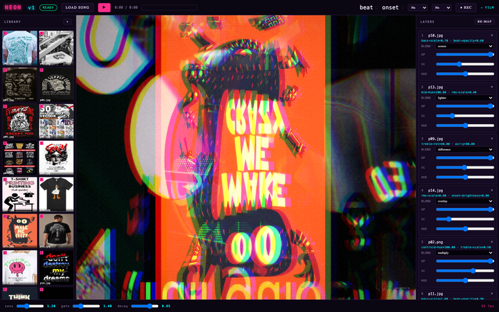

# Sainted Word Records

> An audio-reactive video engine that lives in your browser. Drop a song, drop a library of clips, get a music video. **MP4 export, zero backend, one HTML file.**



## What is this?

A browser-based engine that turns audio + a library of clips into a layered,
audio-reactive video composition. Every asset in your library gets classified
by motion, luma, and mean hue, then routed to the band of the song that suits
it. Press <kbd>RE-MAP</kbd> until you like the composition, then <kbd>● REC</kbd>
to export a real MP4.

The full engine is one HTML file. The 5 visual versions (NEON, FILM, GRID,
SMOKE, HALLUCINATION) are the same engine with different blend / blur / grain
treatments.

**[Open the landing →](./landing.html)**
**[Open the engine →](./index.html)**
**[See the 5 versions →](./versions/)**
**[Get a visualizer →](./campaign.html)** — €25 rendered MP4s for musicians

---

## Visualizer Service

Don't want to run the engine yourself? I render audio-reactive videos as a service.

Five curated visual sets, tuned to specific moods:

- **Neon Church** — electric, club, urban energy
- **Morning Haunt** — nostalgic, film grain, indie warmth
- **Brutalist Grid** — hard geometry, monochrome, precision
- **Dream Sequence** — motion blur, haze, ambient drift
- **System Error** — glitch artifacts, RGB split, controlled chaos

| Tier | Sets | Price |
|------|------|-------|
| Single | 1 set, 1 song, 30s | €25 |
| Double | 2 sets, both rendered | €45 |
| Full Rotation | all 5 sets, 5 renders | €75 |
| Custom Source | your assets + 1 SWR set | €55 |

Free 10-second preview with your track. 48-hour delivery. Commercial rights included.

→ **[Order at campaign.html](./campaign.html)**

The engine itself stays open-source (MIT). The service is the rendered output.

## Features

- **Adaptive beat detection** — bass-energy tracker with adaptive threshold.
  Locks the BPM, fires an envelope on every kick, decays gracefully.
- **Layered composition** — six layers, each with its own blend mode and a
  stack of reactors. Scale to bass. Hue to mids. Position to the spectrum's edge.
- **Library as palette** — drop a folder of videos, GIFs, or images. Each one
  is auto-classified and routed to the role that suits it.
- **MP4 export, native** — the canvas is captured via `MediaRecorder` at 30 fps
  with H.264 + AAC, 8 Mbps. No ffmpeg.wasm, no server, no transcode.
- **Fresh look every remap** — the auto-mapper picks from the top candidates
  weighted by score, and shuffles the blend order. Each click yields a new
  composition.
- **Single-file, zero install** — the whole engine is one HTML file. Drop it
  in a folder, open it in Chrome or Safari, it runs.

## Quick start

```bash
git clone git@github.com:kai-djuric/sainted-word-records.git
cd sainted-word-records
npm install
npm run dev   # http://localhost:5174
```

Or production build:

```bash
npm run build # → dist/ (engine + 5 versions + 27-item library)
```

## How to use the engine

1. Open the engine (or one of the 5 versions) in a browser
2. Click **LOAD SONG**, pick any audio file
3. Wait for the 27-item library to auto-load (or drop your own)
4. Click **▶ PLAY**
5. Click **RE-MAP** until you see a composition you like
6. Pick a duration: `10s / 15s / 30s / 60s / song / manual`
7. Click **● REC** — auto-stops at the chosen duration
8. Browser downloads `sainted-word-{timestamp}.mp4`

The output is real H.264 + AAC, 48 kHz stereo, 30 fps. Plays in any video
editor, uploads to YouTube / TikTok / anywhere.

## Stack

- **Web Audio API** — FFT analysis, 5 bands (sub / bass / mid / treble / air),
  spectral-flux onset detection
- **Canvas 2D** — compositing pipeline
- **MediaRecorder** — H.264 + AAC, MP4 container
- **Web Components** — engine mini preview, theme toggle
- **Vite** — dev server and production build
- **Fraunces + Geist + Geist Mono** — typography

## Project structure

```
sainted-word-records/
├── landing.html              # GitHub project landing page
├── index.html                # The main engine (1 file, ~63 KB)
├── HOWTO-30s-VIDEO.md        # Detailed how-to for 30s recordings
├── library/                  # 27 demo assets (12 mp4 + 15 jpg/png)
│   ├── manifest.json
│   ├── p01.jpg … p15.jpg     # Pinterest sample stills
│   └── c01-rooftop.mp4 … c12-abstract.mp4  # creatorium B-roll
├── versions/                 # 5 aesthetic variants
│   ├── index.html
│   ├── neon.html
│   ├── film.html
│   ├── grid.html
│   ├── smoke.html
│   └── hallucination.html
├── verify-*.mjs              # Puppeteer end-to-end tests
├── package.json
├── vite.config.js
└── verify-screenshots/       # Reference screenshots for landing page
```

## License

MIT — see [LICENSE](./LICENSE).

## Author

**Kai Djuric** · [@kai-djuric](https://github.com/kai-djuric)
