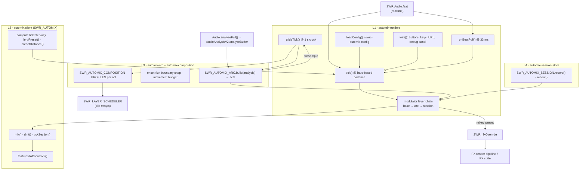
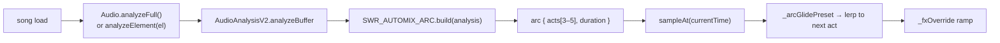

# SWR Automix Engine — Architecture & Future

*Last revised 2026-10-01. Supersedes the earlier "evolution stack" draft
(previously tracked as `docs/AUTOMIX-ARCHITECTURE.md`) — its verified details
are folded in below.*

**Implementation files**

| File | Role |
|---|---|
| `client/automix-runtime.client.js` | L1 runtime: bootstrap, config, UI wiring, tick orchestration, modulator layer chain, glide clock |
| `client/automix-arc.client.js` | L3 macro song arc: 3–5 deterministic acts from full-song analysis |
| `client/automix-composition.client.js` | Micro clip-cutting profiles per act; couples the arc to the layer scheduler |
| `client/automix-session-store.client.js` | L4 cross-song novelty memory (last 5 songs' anchors) |
| `client/automix.client.js` | Mix engine (`SWR_AUTOMIX`): coords, drift, section tick, presets, tuning |
| `client/preset-anchor-map.client.js` | `SWR_ANCHOR_MAP` — the 2-D anchor space the arc walks |
| `client/last-mix-store.client.js` | `SWR_LAST_MIX` — persisted "last session" blend (optional) |
| `engine-transitions.client.js` | `window.SWRTransitions` — 28-transition vocabulary (integration target, see §Integration) |

Plan of record for the evolution stack lives in the session artifact
`automix-evolution-plan.md`.

---

## What it is

The automix engine is SWR's **self-evolving smart automixer**: it continuously
chooses where a music-video surface should sit in a two-dimensional visual space
— **warmth** × **intensity** — and smoothly ramps the engine's live FX state
toward that target, so the picture evolves *with* the song instead of sitting on
a hand-picked preset. It reads audio two ways: cheap realtime features
(`window.SWR.Audio.feat`: onset, centroid variance, BPM, beat pulse) and a
one-shot full-song analysis (`AudioAnalysisV2.analyzeBuffer`) that yields
duration, BPM, an onset list and key. From the full-song analysis it derives a
deterministic **macro arc** (3–5 acts), and it walks a curated **anchor map** —
named points in warmth/intensity space, each carrying a full FX preset — to give
the song a visible dramatic shape. A composition layer turns that shape into a
*cutting rhythm* for the on-screen clips, and a session store keeps the engine
from re-treading the same anchors across consecutive songs.

Everything is client-side and offline. Nothing leaves the device.

---

## Architecture Overview

Four layers, each independently loadable and testable. Upper layers degrade to
no-ops when a lower layer is absent, so any surface can ship a subset.



### 1. `automix-runtime` — runtime bootstrap, config loading, UI wiring

Owns the lifecycle and the orchestration. Public surface:
`window.automix.{toggle,start,stop,freeze,saveBlend,lockToNearest}` and
`window.SWR_AUTOMIX_RUNTIME = { automix, version:'1.0.0', ui:{wire,unwire,renderDebug}, loadConfig, _config, _toggleShortcut }`.

* **Clocks.** Three independent timers, deliberately at different timescales:
  * the **tick** (`_scheduleNext`) runs at `SWR_AUTOMIX.computeTickInterval(feat)`
    — a bars-based cadence that can stretch to ~20 s at low feat energy
    (`TICK_DEFAULT_MS = 1500` fallback);
  * the **1 s glide clock** (`_glideTick`) — slow continuous macro motion that
    must stay visible *between* ticks;
  * the **33 ms beat poll** (`_onBeatPoll`) — beat-pulse edge detection driving
    per-beat drift and the bar nudge.
* **Layer chain.** `tick()` builds a per-tick `ctx` and reduces an ordered
  `LAYERS` array of `{ id, apply(mix, feat, ctx) }`. New evolution ideas become
  a layer object, never another edit to `tick()`:

  | Layer | Owns | Timescale |
  |---|---|---|
  | `base` | legacy realtime pick / lock mode | per tick |
  | `arc` | **macro direction** — replaces the mix when a song arc exists | whole song, 3–5 acts |
  | `session` | L4 novelty — reroutes to an unused neighbour | per song |

  `_lastMixedVia` reports `'arc'` or `'legacy'` for the debug panel.
* **Config.** `loadConfig()` parses `#swrc-automix-config` (or an override
  string for tests), validates every field, and applies: `enabled`,
  `poolBias` (per-section warmth/intensity ranges, merged into
  `SWR_AUTOMIX.POOL_BIAS`), `driftAmplitude`, `tuning`
  (`barsPerTick` preferred, legacy `minTickMs`/`maxTickMs` accepted),
  `ui.toggleLabel`, `ui.toggleShortcut`, `defaultState`. Invalid JSON →
  `console.warn` + defaults; a `__proto__`/`constructor`/`prototype` key in
  `poolBias` is rejected to prevent localised prototype pollution.
* **UI wiring.** Auto-wires on `DOMContentLoaded` unless
  `window.SWR_AUTOMIX_NO_AUTOWIRE = 1` (music_video pages predate the extracted
  runtime and keep their own wiring). Buttons: toggle / freeze / save / lock /
  debug. Keys **A** (toggle, configurable), **F** freeze, **B** save blend,
  **K** lock, **D** debug. URL deep-links: `?automix=1`, `?automix-debug=1`,
  `?automix-frozen=1`, `?automix-locked=1`. Enabled/debug state persists to
  `localStorage`. The debug panel renders a live strip (section, coords, anchor,
  tick rate, interval, preset fields, and the L3 arc with the current act marked
  `▶`), and reports *why* automix is inert ("no song loaded" vs "this page plays
  without an audio element").
* **Events.** `_emit()` dispatches on **`window`** (not document):
  `swr-automix-tick`, `swr-automix-glide`, `swr-automix-arc`,
  `swr-automix-freeze`, `swr-automix-save`, `swr-automix-lock`.

### 2. `automix-arc` — macro song structure via onset flux analysis

The measured problem (2026-09-24, 75 s probe): without a macro layer, automix
motion is Brownian — field ranges of 0.14–0.17 on 0–1 uniforms over 75 s. This
layer gives every song a deterministic trajectory so change over time is
guaranteed and visible.



Contract (`window.SWR_AUTOMIX_ARC`):

```
build(analysis) → arc | null
  analysis: { duration (s), bpm, onsets: [s], key?, energy? }
  Deterministic: same analysis ⇒ same arc.
arc.sampleAt(currentTime) → { actIndex, actCount, actName, actProgress,
                              anchorId, coords, preset, rampMs } | null
arc.acts → [{ t0, t1, anchorId, coords, preset, name, rampMs }]
analyzeElement(el) → Promise<analysis>   // generic path for variant pages
```

Steps inside `build()`:

1. **Seed & act count.** `mulberry32(hashSeed(analysis))`; act count is
   `MIN_ACTS + floor(rng()*(MAX_ACTS-MIN_ACTS+1))`, clamped to 5.
2. **Boundaries.** `fluxCurve()` bins onsets into 2 s windows (onsets/second).
   Each equal-fraction boundary is snapped to the lowest-flux point inside a
   `±SNAP_WINDOW` (12 %) window, with a tiebreak penalty
   `0.5·|t−center|/dur` toward the target fraction. Skipped for songs ≤ 45 s.
   Independent picks can cross, so interior bounds are sorted and clamped to a
   `minSpan = dur/(nActs·4)`; a degenerate overflow falls back to equal fifths.
3. **Archetypes.** `intro → (shuffled lift/peak/breakdown) → outro` — always
   starts intro-ish, ends outro-ish, middles permuted deterministically. Each
   archetype biases intensity/warmth and carries full-range targets
   (mut, grain, glow, …).
4. **Anchor walk.** For each act, `map.neighbours(targetCoords, 6)`; reject any
   candidate closer than `ARC_MIN_DISPLACEMENT` to the previous act's anchor;
   after exhausting the list take the farthest candidate.
5. **Baseline.** The anchor's preset is blended 50/50 with the archetype's
   targets across `temp, mut, posterize, chroma, grain, sepia, glow, grayscale`
   (`mutAlgo` copied through), so loud acts genuinely reach the top of the dial
   instead of clustering low.
6. **Movement budget check.** A final pass returns `null` if any consecutive
   pair is closer than `0.9 × ARC_MIN_DISPLACEMENT` — the contract is
   load-bearing, not just heuristic.

**The glide.** A static per-act baseline converges inside the 1 s ramp and stays
there (measured Δ = 0.000 over a 47 s act). So the act baseline glides
continuously toward the *next* act's baseline on the 1 s clock; the **last act
wraps to the first** (the outro drifts back toward the intro's feel). At a
boundary the state is already on the next baseline, so the ramp is a no-op and
the transition is seamless. `_arcGlidePreset()` is shared by the tick's `arc`
layer and the glide clock, so both compute identical motion.

The arc layer is **best-effort and async**: until the analysis lands the layer
is a passthrough and the legacy realtime path runs (no dead air at t = 0).
`_ensureArc()` rebuilds only when the audio element's `src` changes, retries up
to 3 times per `src`, and clears the guard on failure so a transient decode
rejection retries later.

### 3. `automix-composition` — micro clip-cutting profiles per act

The arc owns the macro FX direction; this layer extends the act into the **media
composition** — how often the layer scheduler swaps clips — so the *arrangement*
of clips changes with the song, not just the colour grade.

| Act | Cut window (s) | Intent |
|---|---|---|
| `intro` | 9–14 | establishing, slow |
| `lift` | 6–10 | building |
| `peak` | **2.5–5** | fast cutting |
| `breakdown` | 12–20 | one long mood |
| `outro` | 8–14 | settling |
| unknown | 6–10 | `DEFAULT_PROFILE` |

* **Act changes** fire on the 1 s `swr-automix-glide` event (tighter than the
  8–20 s tick cadence, so cuts land on the section change): `apply(actName)` sets
  the scheduler config and `sched.swapNow()` kicks a beat-snapped crossfade.
* **Within-act envelope:** `sched.setProgress(pmin, pmax)` interpolates this
  act's window toward the next act's by `actProgress` — cuts tighten into a
  peak, release into a breakdown, settle in the outro, instead of stepping flat
  between per-act constants. The postMessage is skipped when the interpolated
  window moved < 0.05 s.
* **Global invariant:** a clip never stays visible longer than 8 bars
  (`cap8 = 32·60/bpm`). BPM is **sanitized** first — the realtime estimator can
  emit garbage (e.g. 1000+ on synthetic tones), so anything outside 30–250 BPM is
  replaced by 120.
* **Media pool:** clips come from either the engine `Library` or the `+ ADD`
  media store (`SWR_MEDIA.getUserMedia()`). Blob-URL wrappers are cached by
  content signature and the previous URLs revoked on change (the naive version
  leaked one blob URL per item per call). A one-time stage auto-populate adds up
  to 3 layers when the stage is empty.
* **Fallback:** a 10 s poll applies the `lift` profile when automix is enabled
  but no act stream has arrived, so clip evolution never depends on the FX mix
  succeeding.
* **Emit:** `document` `swr-composition-change` `{ act, profile, reason }`.
* **Manual API:** `window.SWR_AUTOMIX_COMPOSITION.{apply, PROFILES}`.

Defensive throughout: no scheduler / no arc / no act info → no-op, and the
page's manual scheduler settings win whenever the user touches the panel (act
changes re-apply on the next act boundary, not on every knob move).

### 4. `automix-session-store` — cross-song novelty avoidance

Unit-testable under Node without a browser (same pattern as `last-mix-store`).

```
window.SWR_AUTOMIX_SESSION.record(songKey, anchorIds)   // upsert by songKey
window.SWR_AUTOMIX_SESSION.recent()                     // deduped, newest-first
window.SWR_AUTOMIX_SESSION.KEY = 'swr.automix.session.v1'
```

* Storage shape: `{ "songs": [{ key, ts, anchorIds }] }` in `localStorage`.
* Caps: **≤ 5 songs** (oldest shifted out), **≤ 8 anchor ids** per song.
  Re-recording the same key replaces the entry.
* Never throws: corrupted/unparseable payloads are treated as empty and
  overwritten on the next record; private-mode writes fail silently.
* The runtime accumulates this song's anchors per tick (`_sessionAnchors`) and
  flushes them in `_ensureArc()` when `el.src` changes — the **only** recording
  hook, so mic-only / no-element pages stay inert.

The `session` layer consumes `recent()`: if the picked anchor is a repeat, it
looks at the 4 nearest anchors and reroutes to the first unused one
(`sessionRerouted: true`); if every nearby anchor is a repeat, the current one
stands (novelty never wins over continuity).

---

## Key Design Decisions

### Deterministic PRNG (mulberry32 seeded from duration + BPM + onset count)

`hashSeed(analysis) = round(duration·1000) + round(bpm·977) + onsets.length·31 + key.length·7`,
folded to uint32 and fed to `mulberry32`. **Same song ⇒ same arc ⇒ same
composition**, every load, on every machine. A song's arc is its *signature*,
not a random walk. This makes the whole stack reproducible in tests and means a
user who reloads gets the same visual journey — the automation is a property of
the song, not of the session's dice.

### Movement budget: `ARC_MIN_DISPLACEMENT = 0.25` Euclidean on warmth/intensity

The executable form of "changes over time are visible". The anchor walk rejects
candidates closer than 0.25 to the previous act; a final pass returns `null` if
any consecutive pair is closer than `0.9 × 0.25`. `build()` returning `null` is a
supported outcome (the runtime falls back to the legacy realtime path) — the
budget is a hard contract, not a preference.

### Onset flux snapping (`SNAP_WINDOW = 0.12`)

Act boundaries land on musical "breaths" (low onset-flux valleys) within ±12 %
of duration of their equal-fraction target, not on arbitrary fifths. Cheap:
derived from the `onsets` array `analyzeBuffer` already returns, no extra
analysis pass.

### Novelty avoidance with bounded session memory (decay by eviction)

There is **no numeric novelty score**; decay is implemented by bounded-window
eviction. Per *song*, only the 8 most-recent distinct anchors are remembered;
across *songs*, only the last 5 songs survive. `recent()` dedupes and returns
newest-song-first, so old usage fades out of influence exactly as it ages out of
the window. This is O(1) memory, needs no tuning constants, and cannot grow
unbounded on a long listening session.

### Deep-copy arc immutability

```js
prev = { coords: { ...chosen.anchor } };
```

The walk snapshots the previous anchor's coordinates rather than holding a
reference into the anchor map. Later stages (the `session` layer, the drift, the
bar nudge) rewrite `_fxOverride` and mixed presets freely, and the movement
budget must not be measured against a mutated object. The runtime likewise
deep-copies before assigning a new target (`this._fxFrom = Object.assign({}, SWR._fxOverride)`),
and `saveBlend()` copies the preset it persists.

### One slow macro clock, decoupled from the musical tick

`computeTickInterval` is deliberately *musical* — it stretches with bars and low
feat energy — but a macro glide at that cadence would teleport the whole
act-to-act displacement into one invisible step. The 1 s glide clock keeps the
macro motion continuous; the tick layers phrase. Two clocks, two jobs.

### Graceful degradation everywhere

Every layer is optional. Missing arc → legacy realtime path. Missing scheduler →
composition no-ops. Missing analysis script → bounded retry then arc disabled for
that `src`. Blocked storage → empty store, silent. Malformed config → defaults.
Nothing in the automix stack throws into its caller.

### Allocation and DOM discipline

The stack is written for a per-frame / per-second hot path: no per-tick closures
or array allocations (`nn[(Math.random()*nn.length)|0]` instead of
`filter().bind()`), byte-identical glide keys skipped before allocating a
`CustomEvent`, `textContent` writes skipped when unchanged, blob URLs cached and
revoked by signature, and `setProgress` postMessages skipped when the value did
not move enough to matter.

---

## Advantages

1. **Reproducible.** Deterministic PRNG + pure `build()` means a song always
   yields the same arc; bugs are reproducible from `(duration, bpm, onsets)`.
2. **Visible by contract.** The movement budget plus the displacement smoke test
   turn "the picture should evolve" into an assertion that fails CI when broken —
   the bug class that shipped silently three times.
3. **No dead air.** The realtime path runs from t = 0; the arc takes over when
   the analysis lands. A failed analysis degrades, it does not disable.
4. **Composable, not monolithic.** `tick()` is a reducer over layer objects;
   adding hue-bias or transition-cadence is a new object, not surgery.
5. **Layered and independently testable.** Each layer loads standalone; the arc
   and session store are exercised in `node:vm` with no browser.
6. **Cheap.** Onset-flux boundaries reuse the existing analysis; session memory
   is O(1); the whole thing is plain ES5-ish JS with no dependencies.
7. **Private and local.** All state is `localStorage`; no network.
8. **Defensive.** Every failure mode has a defined, non-throwing fallback.

---

## Flexibility Points

Where the system can be extended without touching core logic:

* **`LAYERS` array** (`automix-runtime.client.js`) — insert
  `{ id, apply(mix, feat, ctx) }`; priority order *is* the array order.
* **`ARCHETYPES` table** (`automix-arc.client.js`) — add/retune the arc's
  emotional grammar; the shuffle and baseline blend pick it up automatically.
* **`PROFILES` table** (`automix-composition.client.js`) — retune per-act cut
  windows, or add new act names.
* **Constants** — `MIN_ACTS`, `MAX_ACTS`, `ARC_MIN_DISPLACEMENT`, `SNAP_WINDOW`,
  `MAX_SONGS`, `MAX_ANCHORS`, the 8-bar cap.
* **The anchor map is data.** `preset-anchor-map.client.js` is the single source
  of anchors and presets; adding anchors changes every song's arc with no engine
  edit.
* **`#swrc-automix-config`** — per-surface overrides of pool bias, drift
  amplitude, tuning, labels, shortcut, default state, and a kill switch
  (`enabled:false`).
* **Public API on `SWR_AUTOMIX`** — `mix`, `computeTickInterval`, `drift`,
  `lerpPreset`, `presetDistance`, `smoothstep`, `tickSection`,
  `featuresToCoords`, `featuresToCoordsV2`, `blendAnchors`, `isStuck`,
  `isFlatAudio`, the `_setDriftAmplitude` / `_setTuning` setters, and the
  exported constant tables (`FIELDS`, `POOL_BIAS`, `BARS_PER_TICK`, …).
* **The event bus** — `swr-automix-tick` / `-glide` / `-arc` / `-freeze` /
  `-save` / `-lock` and `swr-composition-change` are the extension seams any new
  consumer subscribes to.
* **Layer APIs** — `SWR_AUTOMIX_ARC.{build,sampleAt,analyzeElement}`,
  `SWR_AUTOMIX_COMPOSITION.{apply,PROFILES}`,
  `SWR_AUTOMIX_SESSION.{record,recent}`.
* **Presets are plain objects** — `lerpPreset`/`presetDistance` operate on the
  `FIELDS` list, so a new FX field is a one-line addition to `FIELDS`.

---

## Integration Opportunities

### `engine-transitions.client.js` — auto-fire transitions between acts

`window.SWRTransitions` exposes `fire(name, opts)`, `list()`,
`setAutoFire({onBeat, everyNBeats, transition})`, `setBPM(bpm)`, `onBeat(bpm, hit)`
and the raw `_TRANSITIONS` catalog (28 named transitions, each tagged with a
`family`: cover / distortion / spatial / brightness / mask / hybrid / fade /
wipe, and a `kind`: `css` | `fx`). It emits `document` `swr-tx:fire` and records
a targeting signal on every fire.

**The wiring** is a listener on `swr-automix-glide`:

```js
window.addEventListener('swr-automix-glide', function (ev) {
  if (ev.detail.actIndex === lastIdx) return;      // only on act change
  lastIdx = ev.detail.actIndex;
  const fam = { intro: 'fade', lift: 'wipe', peak: 'distortion',
                breakdown: 'brightness', outro: 'fade' }[ev.detail.actName];
  const names = window.SWRTransitions.list()
    .filter(t => t.family === fam).map(t => t.name);
  window.SWRTransitions.fire(names[actIndex % names.length], { _src: 'automix-arc' });
});
```

This is the single highest-value integration: it makes the *transition* between
clips land on the act boundary, not just the cut cadence. Note the file header's
current status: the module is loaded but has **no engine.html wiring yet** —
engine integration is the follow-up.

### `targeting.rules.json` — persona-driven composition profiles

`client/targeting.client.js` classifies the session into one of 28 workflow
personas and exposes `SWR_TARGETING.classify()` /
`.persona()`, plus `personaToTransitions` (total over all personas). A persona
is a natural selector for a **composition profile set**: e.g. `live-vj` →
fast cuts and `peak`-heavy arcs, `anchor-curator` → long holds. Feed
`SWR_TARGETING.persona()` into a `PROFILES` override at
`SWR_AUTOMIX_COMPOSITION` load time. The rules table is data
(`targeting/rules.json`, built by `targeting-pipeline/build-rules.mjs`), so the
mapping persona → profile can ship as data, not code.

### `variant-switcher.client.js` — variant-specific composition profiles

`window.SWR_VARIANTS` exposes `list()`, `current()`, `activate(id)`,
`deactivate()`, `postFx(ctx)`. Each variant has a signature look and default
song. Read `SWR_VARIANTS.current()` when applying a composition profile so the
grid variant cuts harder than the film variant at the same act, and so a variant
change re-applies the profile immediately. Variants already host automix (there
are `verify:{neon,film,grid,smoke,hallucination}-automix` suites), so the seam
exists.

### `swr-natural.client.js` — natural evolution feedback / mirror effects

`lib/swr-natural.client.js` (`window.SWR_NATURAL`) enforces the look contract:
envelope followers on every numeric `Audio.feat` field, the house grade, a
feedback-trail echo, and a rotating vertical-axis mirror with
`setMirror`/`setEnabled` and live counters on `SWR_NATURAL.stats`. The automix
arc is a natural driver for **mirror intensity** — e.g. a peak act pushes the
mirror angle/strength up, a breakdown pulls it toward zero — via the existing
`setMirror` setter, without the arc having to touch the renderer.

### `FX.state` — real-time filter modulation synced to arc

`SWR._fxOverride` is the ramp target the render pipeline consumes into
`FX.state`. Consumers can read `FX.state` (and the arc's `actProgress`) to
modulate filters per-frame. Two invariants to respect: `FX.intensity` is a
render-time multiplier and is **never written into state**; and the
`adaptive-guard` ladder must step down with `FX.setFrameSkip(n)`, never
`FX.setEnabled(false)`, because on engine the overlay *is* the composite and
disabling it freezes `FX.state` — the very signal the displacement contract
measures.

### Preset ↔ transition pairing

`lib/preset-transitions.client.js` (`window.SWRPresetTransitions`) already maps a
version-presets preset to recommended transitions
(`recommended(presetKey)`, `applyPresetAutoFire(presetKey, {bpm, rotate})`) from
`data/preset-transitions.json`. The arc's act anchor carries a preset, so an act
can arm `applyPresetAutoFire(actAnchorPresetKey)` — the transition vocabulary
then follows the act's colour grade.

---

## Improvement Roadmap

### Easy (1–2 hours)

* **Expose composition profile selection to the UI.**
  Add a `#automix-composition` `<select>` (or debug-panel rows) that writes into
  a new `SWR_AUTOMIX_COMPOSITION.setProfiles(partial)`; persist to
  `localStorage`. Acceptance: changing the peak window in the UI changes the
  next act's `swr-composition-change` payload.
* **Add an "arc-only" mode (macro structure without clip composition).**
  A config flag `arcOnly: true` that makes `automix-composition`'s listeners
  early-return while the `arc` layer still drives `_fxOverride`. Acceptance: with
  the flag on, FX state still moves ≥ 0.3 per act but `SWR_LAYER_SCHEDULER`
  config is untouched.
* **Integrate engine-transitions auto-fire between acts.**
  Add the `swr-automix-glide` listener above to `engine.html` (or a small
  `client/automix-transitions.client.js` bridge) mapping act → transition
  family. Acceptance: `verify-transitions.mjs` still green and a new smoke
  asserts one `swr-tx:fire` with `_src:'automix-arc'` per act boundary.

### Medium (1–2 days)

* **Persona-specific composition profiles via targeting.**
  Bridge `SWR_TARGETING.persona()` → profile overrides; ship the mapping as data
  in `targeting/rules.json`. Acceptance: two different personas produce
  different `PROFILES.peak` windows on the same song, verified headless.
* **Variant-specific composition via variant-switcher.**
  Key profile overrides off `SWR_VARIANTS.current()` and re-apply on
  activation. Acceptance: grid and film differ in cut cadence at the same act;
  deactivating restores the default.
* **Per-act FX preset interpolation along the arc.**
  Today `_arcGlidePreset` lerps only to the *next act's* baseline. Add a
  curve-shaping option (ease-in on `lift`, hold-then-release on `peak`) as a new
  field on the `arc` layer's output. Acceptance: displacement contract still
  green; new unit test pins the shaped curve.

### Hard (1+ week)

* **ML-based clip selection trained on engagement metrics.**
  Requires an engagement signal (watch-time / retention) collected locally, a
  feature vector (act archetype, feat summary, clip metadata, coords), and a
  scoring model consulted by the composition layer's clip pool. Ship behind the
  existing `PROFILES` seam. Acceptance: offline eval harness with a held-out
  session split; deterministic fallback when the model is absent.
* **Cross-user style transfer (learn taste from session history).**
  Build on `SWR_AUTOMIX_SESSION`: instead of only *avoiding* recent anchors,
  learn a soft preference distribution over anchors/acts per user and bias the
  anchor walk toward it. Must remain privacy-preserving (local-only, opt-in).
  Acceptance: preference model measurably shifts arc anchor selection across
  repeated sessions while `recent()` novelty still holds.
* **Real-time audio-reactive composition updates.**
  Today the composition responds to the *arc* and BPM; make it respond to
  instantaneous feat (transient density, spectral flux) within an act —
  a burst of onsets tightens the cut window immediately rather than at the next
  glide tick. Needs a smoothing/coupling design so the schedule does not
  thrash. Acceptance: a synthetic onset burst shortens the observed cut interval
  within one glide tick, with a bounded minimum.

---

## Testing Strategy

The stack is verified at three tiers — pure unit, CI smoke, and realtime
runtime regression — plus cross-surface and per-variant suites.

**Unit (Node, `node:vm`, no browser) — in `npm run check`:**

* `scripts/check-automix-arc-unit.mjs` (~11 checks) — determinism, movement
  budget, boundary ordering/min-span, sampling, degenerate/null contracts.
* `scripts/check-automix-session-unit.mjs` (~26 checks) — store caps and
  corruption handling, session-layer reroute/passthrough, pill format,
  song-change flush, glide math, engine-shape `audioEl` transport.
* `scripts/check-automix-unit.mjs` — the core `SWR_AUTOMIX` mix math.
* `scripts/check-clip-evolution-unit.mjs` — composition/clip evolution.

**CI smoke — the gate in `check:full`:**

* `scripts/check-automix-arc-smoke.mjs` — ~9 s. Seeks to each act's baseline
  rather than waiting in realtime (the runtime derives the act from
  `el.currentTime` on the 1 s glide clock, so a seek selects the same act the
  song would have reached, and covers *every* act deterministically), then
  requires consecutive acts to differ by ≥ 0.3 on at least one pipeline field.
  It asserts only *consecutive* pairs — the final act's wrap back to the first
  baseline is deliberate drift, so asserting it would be a false failure. This
  is the gate for the bug class that shipped silently three times (arc not
  loaded, fx-postprocess skipping override consumption, static act baselines).
* `scripts/check-automix-smoke.mjs` — basic runtime smoke (`_fxOverride` exists,
  toggle wiring).

**Runtime regression:**

* `verify-automix-arc-displacement.mjs` — samples 13 FX fields every 5 s for
  80–180 s on `engine.html` and requires ≥ 0.3 absolute movement of at least one
  field per fully-observed arc act, plus the pill's act-context format. The
  sprint gate (too slow for `check:full`).

**Cross-surface and per-variant:**

* `verify-automix-cross-surface.mjs` — 77 checks across three tiers: full
  (engine + 5 core variants), min (17 artistic), off (echo-manifold opt-out).
* `verify:{engine,neon,film,grid,smoke,hallucination}-automix`,
  `verify:dashboard-automix`, `verify:dashboard-automix-integration`,
  `verify:automix.mjs`.
* Adjacent suites that protect the seams: `verify:transitions` (60 checks incl.
  `?diag=1` and the `setIntensity`-never-mutates-`FX.state` invariant),
  `verify:tier-runtime`, `check:grade-smoke`.

**Live probe counters:** `__SCHED_SWAPS`, `__SCHED_POSTS`, `__SWR_SILENCE_FADE`.

Run everything with `npm run check` (fast) and `npm run check:full` (CI gate).

---

## Technical Debt

**Known issues / deferred work**

* **`engine-transitions.client.js` is not wired into `engine.html`.** Its own
  header states the module-only pass; the act→transition auto-fire is the
  integration follow-up (Easy roadmap item). Until then the transition
  vocabulary and the arc do not talk.
* **No numeric novelty score.** L4 novelty is bounded-window eviction only —
  fine for "don't repeat last night's anchors", insufficient for the
  style-transfer roadmap item. The store has no timestamps *used* for decay
  (`ts` is written but `recent()` ignores age), so a song played yesterday and
  one played a minute ago weigh the same until evicted.
* **`analyzeElement` hard-codes `/audio-analysis-v2.js`.** The absolute path is
  deliberate (relative `../` 404s on nested routes), but it couples the arc to a
  root-relative asset and to a global `AudioAnalysisV2`.
* **Arc retry budget is per-`src` and fixed at 3.** A song that fails for a
  transient reason early and then recovers after three glide ticks stays
  arc-less for the rest of the song.
* **Movement-budget slack mismatch.** The anchor walk enforces 0.25 but the
  final check accepts 0.225 (`0.9 ×`); documented, but the two numbers can
  drift.
* **BPM sanitization is a band-aid.** The 30–250 clamp masks a realtime
  estimator that can emit nonsense on synthetic tones; the root cause is
  upstream in `Audio.feat`.
* **Composition's 10 s fallback poll always runs** (`setInterval`), even while
  the arc is driving; it early-returns but still wakes and may resolve
  `SWR_MEDIA.getUserMedia()` each time.
* **Composition auto-populate is a side effect.** `apply()` adds up to 3 layers
  from the engine `Library` / media store when the stage is empty — convenient,
  but it means a "read" path mutates the stage.
* **Snapping is skipped for songs ≤ 45 s** — short tracks get equal-fraction
  boundaries, which is a defensible fallback but an inconsistency.
* **`_lastMixedVia` is set but not surfaced** in the debug panel, so the
  arc-vs-legacy routing is invisible to a user debugging a "nothing moves"
  report.
* **Filename case collision.** The previous draft was tracked as
  `docs/AUTOMIX-ARCHITECTURE.md`. On macOS APFS the two names are the *same*
  file, so the case-only rename could not be verified locally; it is committed
  as a rename so case-sensitive checkouts (Linux CI) see only the lowercase
  path. Do not reintroduce a second, differently-cased copy.

**Parked (each is one layer object now)**

* **Hue-bias per act** — warm acts should pick warm *clips*; needs pool metadata
  in the scheduler worker.
* **Transition-cadence coupling** — acts choosing transition families (the
  integration seam exists; the wiring does not).

**Explicitly not planned**

* GPU-string regex tier detection and a persisted "last good tier" (masks
  thermal throttling) — see `lib/tier-runtime.js`.
* Disabling the FX overlay as a perf rung — `FX.setFrameSkip(n)` is used
  instead, because the overlay *is* the composite on engine and disabling it
  freezes `FX.state`, the displacement contract's signal.
