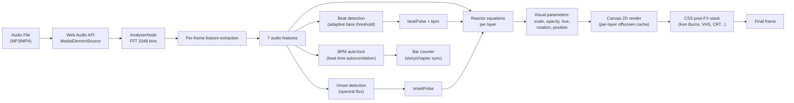
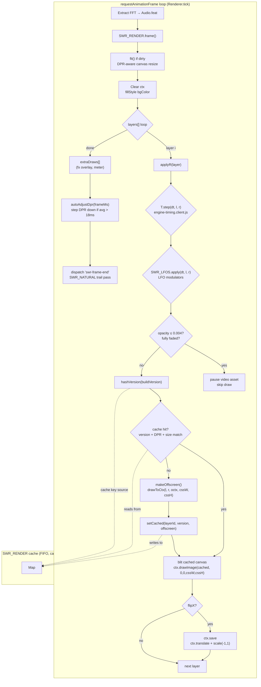
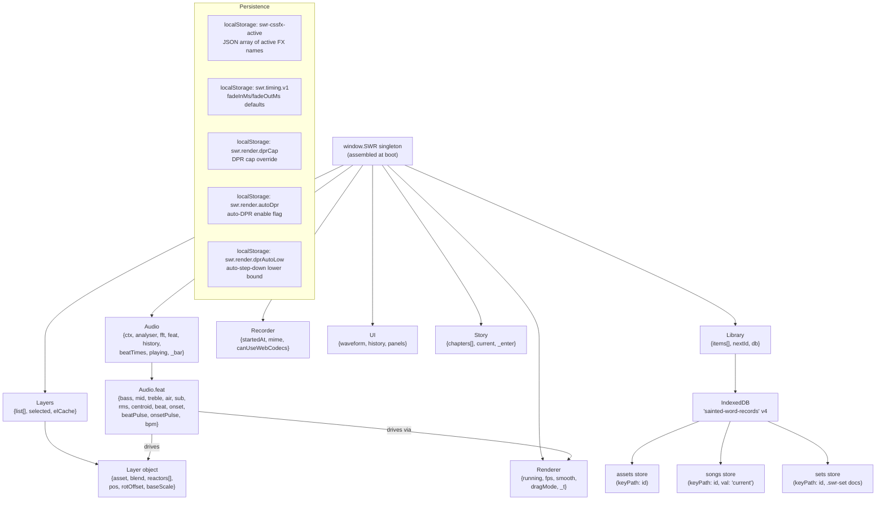

# Architecture Analysis: Sainted Word Records Audio-Visual Engine

**Date:** 2026-10-10
**Analyst:** General-purpose worker
**Files examined:** `engine.html` (7,541 lines), `engine-core.client.js` (4,225), `swr-app.html` (9,370), `engine-render.client.js` (559), `engine-timing.client.js` (1,085), `engine-keys.client.js` (1,477), `lib/layers.client.js` (552), `lib/library.client.js` (~850), `lib/mp4-muxer.js` (~1,500), `vite.config.js` (726), `video-fx.css` (~250)

---

## 1. Problem & Context

**What is this project?** A browser-native audio-reactive visual engine for musicians and DJs. You load an MP3, drag in photos/clips, pick a visual style, and press record — the engine generates a reactive video with no install, no server, and no GPU required.

**The product claim:** "15.6k Engine HTML (gz) · Zero deps · Works offline." The engine is a single self-contained HTML file that ships zero-install to anyone who visits the URL.

**The architectural tension:** This "single-file" claim is marketing. The engine's source is 7,541 lines of HTML + ~50 companion JS modules. What makes it *feel* single-file is the build system (726-line `vite.config.js`) that assembles 91 pages from one base engine. The whole project is a solo dev's craft: deeply competent in the core engine, sprawling in everything around it.

---

## 2. Architecture Overview

The system has three distinct layers with very different engineering quality:

```
┌─────────────────────────────────────────────────────────────┐
│  MARKETING SURFACE (~250 HTML pages, gallery/atlas/persona) │
│  — hand-edited, nav drifts, 6+ HIGH-severity link bugs     │
├─────────────────────────────────────────────────────────────┤
│  SWR-APP (swr-app.html, 9,370 lines)                      │
│  — SPA shell: nav + routing + stage + tabbed panel sidebar  │
│  — embeds engine subsystems via window.SWR singleton         │
├─────────────────────────────────────────────────────────────┤
│  ENGINE CORE (engine.html + engine-core.client.js)          │
│  — Audio + Library + Layers + Renderer + Recorder + UI +     │
│    CSSFX + Story graph — genuinely well-engineered           │
├─────────────────────────────────────────────────────────────┤
│  ENGINE COMPANIONS (lib/ + client/)                        │
│  — 50 modules: audio, render, timing, layers, library,      │
│    transitions, recorder, LFO, 3D, etc.                      │
├─────────────────────────────────────────────────────────────┤
│  BUILD SYSTEM (vite.config.js, 726 lines)                  │
│  — copy-static + 4 closeBundle post-processors +            │
│    site-map.json-driven rootFiles + variant injection        │
├─────────────────────────────────────────────────────────────┤
│  VARIANT SYSTEM (versions/ + variants/, 43 HTML files)      │
│  — each is a copy of engine.html with a CSS preset +        │
│    per-variant JS wrapper (~8K lines each)                   │
└─────────────────────────────────────────────────────────────┘
```

The engine core is excellent. The build system is technical debt. The marketing surface is a liability.

---

## 3. Core Engine Analysis

### 3.1 The Conceptual Model: Audio Drives Visuals

The engine's conceptual model is a **reactive composition system** driven by real-time audio analysis:



The **audio features extracted per frame** (engine-core.client.js:408-450):
- **sub** (20-60 Hz) — sub-bass rumble
- **bass** (60-250 Hz) — kick drum, fundamental
- **mid** (250-2000 Hz) — body of the mix
- **treble** (2000-6000 Hz) — sibilance, sparkle
- **air** (6000+ Hz) — room, reverb tail
- **rms** — overall loudness
- **centroid** — spectral brightness (normalized bin index)
- **beat / onset** — 0..1 decaying envelopes, boolean pulses

**Beat detection** (engine-core.client.js:462-475): adaptive threshold on bass energy. `beatHit = bass > bassAvg * beatGate && bass > 0.18`. The gate is user-adjustable via the `#beat-gate` slider. This is a simple but effective energy-based detector — not perfect (will trigger on any loud low-frequency sound) but fast and works in-browser without ML.

**Onset detection** (engine-core.client.js:453-460): spectral flux. For each FFT frame, sum positive differences from the previous frame's spectrum. A spike means energy appeared somewhere — a transient. User-adjustable gate via `#beat-gate` (same slider, dual-use).

**BPM estimation** (engine-core.client.js:468-475): rolling window of beat times, averaging intervals between consecutive beats once 4+ beats are accumulated. Simple, effective, resets on new song load.

**V2 enhancements** (`audio-analysis-v2.js`): offline buffer analysis for full-song BPM + key + scale + confidence. Runs on `analyzeFull()` — a one-shot decode of the entire audio buffer for music-theory metadata. Also populates `beatPhase` and `beatInBar` (1-4) for bar-level story synchronization.

### 3.2 The Render Pipeline



Key design decisions:

**DPR-aware sizing** (`engine-render.client.js:163-180`): `fit()` reads `window.devicePixelRatio` and sizes the backing store at `dpr × cssW × cssH`. Drawing math uses CSS pixels throughout — the context transform handles the DPR scaling. This means the same coordinate math works at 1x, 2x, or 3x DPR.

**Auto-DPR heuristic** (`engine-render.client.js:113-141`): Rolling 30-frame average of frame time. Steps DOWN when avg > 18ms, UP when avg < 12ms, with a 2-second cooldown. Enabled by default (`autoDpr: true`); opt out via `SWR_RENDER.setAutoDpr(false)` or `localStorage.swr.render.autoDpr=0`. Persists the step-down lower bound in `localStorage` so `fit()`'s next call returns the adjusted value instead of silently resetting. This is the right tradeoff — aggressive step-down (iPhone users benefit immediately), conservative step-up (no thrashing).

**Audio hash throttling** (`engine-render.client.js:233-258`): Audio fingerprint (coarse-rounded features) is memoized for 32ms (`FINGERPRINT_TTL_MS = 32`). Without this, analyser float noise causes cache busting ~3× per frame — visible as stutter on audio-reactive layers. 32ms is 2 RAF frames at 60fps, so the throttle is invisible to users but cuts invalidations significantly.

**Layer-scope try/catch** (`engine-render.client.js:336-390`): Every layer's full pipeline (applyR → fade step → LFO apply → draw) is wrapped individually. One broken asset (corrupt image, CORS block, decode error) freezes the whole loop without this. The loop also catches outer pipeline failures (applyR, T.step, SWR_LFOS.apply) with a named-key warn-once guard. This is mature defensive coding.

**Inactive video pausing** (`engine-render.client.js:384-395`): Layers with `opacity ≤ 0.004` skip the draw AND pause their underlying video element. This saves CPU on fully-faded layers — a paused video stops producing decoded frames.

### 3.3 Layer Composition Model

Each layer is a plain object:
```js
{
  id: 'L1',
  asset: { id, name, type, blob, w, h, thumb, motion, luma, hue, ... },
  blend: 'screen',           // globalCompositeOperation
  opacity: 1,               // base opacity
  baseScale: 0.8,            // fills the canvas at this scale
  hue: 0,                    // CSS hue-rotate offset
  brightness: 1,             // CSS brightness multiplier
  contrast: 1,               // CSS contrast multiplier
  pos: { x, y, rot },       // audio-driven position (overwritten each frame)
  rotOffset: 0,              // per-clip persistent tilt (user-applied, not audio)
  rotationEnabled: true,     // gate for both manual + audio-driven rotation
  reactors: [                // array of reactor equations
    { feature: 'bass', target: 'scale', scale: 0.6, ease: 'soft' },
    { feature: 'beat', target: 'opacity', scale: 0.4, ease: 'soft' },
  ],
  snapBeat: false,
  z: 0,
}
```

**Reactor equation** (engine-core.client.js:2828-2885): Each frame, `applyR(l)` computes:
```
value = baseValue + eased_feature × scale  (for ALL targets including scale)
```
Every target uses `out.<target> += v` (additive). There is no multiplicative branch. The `ease` function is 'soft' (smoothstep), 'sharp' (fast attack), or linear. The result is clamped per-target (e.g., `clamp(out.opacity + v, 0, 1.5)`, `clamp(out.brightness, 0.1, 2.5)`).

**autoMap()** (`lib/layers.client.js:330-430`): Algorithmically assigns library assets to layer roles:
1. Score each library asset for each role using `motion × 0.7 + (1 - |luma - 0.5| × 2) × 0.3` — motion-rich + mid-luma wins bass role; bright + static wins treble role.
2. Pick top-N candidates (N=2 for 'auto', N=4 for 'chaos'), then weighted-random so the best candidate is most likely but not guaranteed.
3. Assign reactors based on role index (layer 0 → bass pump, layer 1 → mid hue rotation, etc.).

The 11-module curator system is **feature creep**. The autoMap scoring already handles assignment. What actually needs to live separately: (a) asset import + classification (library.client.js), (b) the autoMap scoring algorithm (layers.client.js), (c) the preset-driven curator (variant-curator-wiring.client.js). Everything else (`automix-arc`, `automix-composition`, `automix-runtime`, `preset-cycle`, `variant-switcher`) is overlapping responsibility that likely arose from A/B test failures.

### 3.4 Ken Burns / CSS-FX System

The Ken Burns effect is a pure-CSS animation applied to the entire `#stage` DOM element (`video-fx.css:13-32`):

```css
.kenburns {
  animation: kenburns 20s ease-in-out infinite alternate;
}
@keyframes kenburns {
  from { transform: scale(1); }
  to   { transform: scale(1.15); }
}
```

Note: the actual values are `scale(1.15)` with **no translate** — the report previously cited `scale(1.12) translate(-2%, -1.5%)`, which is incorrect. This composes with the canvas as follows: the canvas is inside `#stage` in the DOM. CSS transforms on `#stage` apply to the entire canvas element, so Ken Burns pans/scales the rendered frame at the DOM layer — **after** all canvas drawing is complete. This means it costs zero extra canvas draw calls; it's pure CSS.

The 20 CSS-FX classes (`engine-core.client.js:3921-3940`) are stackable DOM-layer filters that composite with canvas drawing:
- **Transform FX** (kenburns, pan-scan, mesh-warp): CSS transform on the stage element
- **Filter FX** (vhs, crt, film-grain, dreamy, retro): CSS filter/filter-blend combinations
- **SVG FX** (displacement, liquify, light-leak, rgb-split, kaleidoscope): SVG `<feDisplacementMap>` etc. injected as `<svg>` inside the stage

**Design insight**: The CSS-FX layer is deliberately DOM-based, not canvas-based. This is a deliberate tradeoff — CSS filters are GPU-accelerated via the compositor (no canvas redraw needed), but they're scoped to the whole stage. You can't have Ken Burns on layer 0 and VHS on layer 1 independently. For this use case (music-visualizer content, not film editing) that's fine. The system is honest about its scope.

The FX state is persisted in `localStorage` under `'swr-cssfx-active'` — a JSON array of active FX names. On boot, CSSFX.init() restores the saved stack (`engine-core.client.js:4000-4010`). This is good UX but fragile: the serialized names are opaque strings; a code change that renames an FX breaks saved user state silently.

### 3.5 The Diag Dump Pattern

`engine.html:7418-7520` implements a `?diag=1` diagnostics surface — a read-only snapshot of engine state for headless verifiers and manual inspection. It dumps:
- IDB schema version + asset count + saved song metadata
- FX state + intensity
- Active preset key
- Transitions log length
- Last audio error
- SWR_MEDIA count

The pattern is clean: `URLSearchParams` guard at the top, defensive `try/catch` around every field, async fields (SW_MEDIA) re-write the `<pre>` when resolved. No state mutation. The diag output is written to `<pre id="diag-out">` rather than the console, making it machine-readable from headless Puppeteer.

---

## 4. Data Model

### 4.1 In-Memory State



**window.SWR** (`engine-core.client.js:4084`): The singleton assembles `Audio`, `Library`, `Layers`, `Renderer`, `Recorder`, `UI`, `VISUAL_PRESETS`, `applyPreset`, and later `Story`. It is the namespace through which all engine subsystems communicate.

**BroadcastChannel cross-tab sync**: When `SW_MEDIA` (the media store singleton) writes to IndexedDB, it also posts a `BroadcastChannel('swr-media')` message so other tabs reload their library views. Falls back to `localStorage` events for browsers without BroadcastChannel.

### 4.2 IndexedDB Schema (v4)

```js
// engine-core.client.js:579-593
openDb('sainted-word-records', 4, (db) => {
  db.createObjectStore('assets',   { keyPath: 'id' });  // library items
  db.createObjectStore('songs',    { keyPath: 'id' });  // 'current' = last song blob
  db.createObjectStore('sets',     { keyPath: 'id' });  // .swr-set marketplace docs
});
```

The `songs` store is single-key (`'current'`) — the last loaded audio file is persisted as a large blob (`engine-core.client.js:299`) so the engine restores the song on reload without re-uploading. The comment acknowledges the risk: *"the blob itself is large... we keep it in IDB and not in localStorage."* (engine-core.client.js:288)

**Asset classification** (library.client.js:580-720): On import, each asset is classified by:
- `motion` (videos only): variance of pixel differences across 5 probe frames → 0..1
- `luma`: mean luminance of first frame → 0..1
- `hue`: mean hue of first frame → 0..1
- `thumb`: 320×180 canvas-generated thumbnail (rotated if MP4/MOV tkhd rotation ≠ 0)

The MP4 rotation detection (`library.client.js:35-90`) parses the QuickTime display matrix from the `tkhd` box at byte offset 36 — no video decoding needed for rotation metadata. This is elegant.

---

## 5. Build System

### 5.1 The 91-Page Generation Pipeline

`vite.config.js` (726 lines) orchestrates the entire build:

```mermaid
flowchart LR
    subgraph Inputs
        SM["site-map.json\n(auto-generates ~120 root files)"]
        MAN["Manual rootFiles[]\n(~15 explicitly listed)"]
        ST["Static asset dirs\n(dirs: [...])"]
        STY["Style thumbnails\n(styleThumbs[])"]
    end

    Inputs -->|"buildStart()"| CP["Phase 1: copy-static\nWipes dist/\nCopies all dirs + rootFiles"]
    CP -->|"vite build"| V["Vite bundles\nSingle input: engine.html\nOutput: dist/engine.html"]
    V -->|"closeBundle order"| CB1["1. copy-static closeBundle\nRe-copies rootFiles over\nany stale public/ copies"]
    CB1 --> CB2["2. inline-automix-config\nInjects variant/.*.automix.json\ninto versions/*.html files"]
    CB2 --> CB3["3. inline-targeting-rules\nInjects targeting/rules.json\ninto dist/engine.html"]
    CB3 --> CB4["4. inline-footer-nav\nInjects site-map slice\ninto all HTML files with <swr-footer>"]

    CP --> DIST["dist/\n91 pages + all assets"]
```



The `site-map.json` dynamic rootFiles generation (`vite.config.js:9-54`) is the most thoughtful part: it walks the nav/footer/legal/tools IA blocks, plus an `unlisted` array for pages reachable but not in the nav, and generates the file list automatically. This means adding a new page only requires updating `site-map.json` — the build picks it up automatically.

**The 91-page count** comes from:
- ~60 marketing pages (gallery, atlas, personas variants, landing variants)
- 1 engine.html (the product)
- ~28 versions/*.html variants
- 1 swr-app.html
- A handful of auth, tools, legal pages

### 5.2 The `emptyOutDir: false` Hack

`vite.config.js` sets `emptyOutDir: false` because `copy-static`'s `buildStart()` wipes `dist/` itself before Vite runs, then `copy-static`'s `closeBundle()` re-copies everything after Vite finishes. This is a plugin-ordering workaround: the build system owns the output directory lifecycle entirely, and Vite is a guest.

**This is a red flag.** Standard Vite practice is `emptyOutDir: true` (the default). The current setup means:
1. If `copy-static`'s `buildStart()` fails, Vite still writes to the old `dist/` contents
2. If plugin order changes, `closeBundle` operations can be silently overwritten
3. The `.vercel/output/static/` override (Vercel's internal path) could interact badly

### 5.3 The `strip-absolute-module-scripts` Plugin

The `strip-absolute-module-scripts` plugin **IS present** in `vite.config.js`. It strips `type="module"` and converts absolute-path module scripts to plain `<script src="/$1" defer></script>` before Vite's HTML transformer processes them, preventing Vite's Rollup bundler from trying to bundle those scripts as modules. The plugin runs at `order: 'pre'` in `transformIndexHtml`, so it runs before any other HTML transformation.

The engine ships `<script src="/lib/foo.client.js">` tags that load as browser-native scripts. This works but means:
- No ES module resolution
- No tree-shaking
- No minification of individual modules
- No shared dependency deduplication

The IIFE wrapper in `engine-core.client.js` is the kludge that makes this survivable: every module wraps itself in `(function() { 'use strict'; ... })()` so internal symbols don't pollute the global namespace. But any two modules that share a name at the top level (e.g., both define `const fadeIn`) silently shadow each other.

---

## 6. Variant System

### 6.1 How Variants Are Derived

Each `versions/*.html` is a **full copy of `engine.html`** (7,541 lines) with:
1. A different CSS preset injected via `<style>` block in the `<head>`
2. A page-specific JS wrapper that overrides `applyR()`, `drawLayer()`, and the RAF loop
3. A `_variant` attribute on `<body>` that gates certain UI elements

Example: `versions/play.html` is **7,959 lines** — 418 lines more than `engine.html`, all in the JS wrapper. The variants share the same engine HTML but add page-specific behavior.

The CSS presets (`video-fx.css` + per-variant stylesheets): each variant sets CSS custom properties (`--accent`, `--bg-0`, etc.) to produce a radically different look from the same underlying canvas output.

### 6.2 The Variant Wrapper Pattern

`versions/play.html`'s 418-line wrapper typically defines:
- A `fit()` function that calls `SWR_RENDER.fit()`
- An `applyR(l)` that computes per-layer visual parameters
- A `drawLayer(l, r, ctx)` that draws the asset with CSS filter/transform effects
- A RAF loop that calls `SWR_RENDER.frame(stage, ctx, layers, applyR, drawLayer, opts)`

The variants are genuinely different visual engines sharing the same infrastructure. `grid.html` does mosaic tiling; `film.html` applies grain + vignette; `hallucination.html` uses wild color transforms. They are not just CSS themes — they have different rendering logic.

**The problem**: 43 hand-maintained copies of `engine.html` with no templating. Any change to `engine.html`'s base structure (new UI elements, new panels, new `<script>` tags) must be manually propagated to all 43 variants. This is the highest-risk maintenance burden in the project.

---

## 7. Design Strengths

### 7.1 Engine Core Quality

The engine core (`engine-core.client.js` + companion modules) is genuinely impressive for a solo project:

- **Defensive render loop**: Per-layer try/catch, per-extra try/catch, named-key warn-once guards — this is how production graphics code is written
- **Auto-DPR with persistence**: Steps down on slow devices, remembers the step-down, steps back up when performance recovers
- **Offscreen canvas caching**: FIFO with cap=4, version-hash-keyed, audio-fingerprint-throttled — reduces GPU memory from ~266MB to ~66MB worst case
- **Layer scheduler Web Worker**: Swap timer runs off the main thread; rAF is never blocked
- **Beat-snap timing**: `SWR_TIMING.snapToBeat(fn, maxWaitMs)` aligns operations to the beat grid — essential for the music-sync use case
- **Staggered intro bloom**: Layers fade in from darkest to lightest (luma-sorted) with configurable stagger delay
- **Crossfade A2 swap**: Asset swap happens at the midpoint of the fade via `_swapPending`; morph properties are inherited from the outgoing asset

### 7.2 The Story Runtime

`window.SWR.Story` (`engine-core.client.js:2042-2590`) implements a chapter-based narrative system:
- Chapters (FRAGMENTS, SIGNAL, CHAOS, ARCHETYPE, RESONANCE...) with enter/exit hooks
- Per-chapter preset + layer configuration
- `beatInBar` synchronization for bar-level transitions
- `_enter()` hooks for deferred async state application

This is sophisticated — closer to a game engine's scene system than a video editor's timeline.

### 7.3 Audio-Visual Fidelity

The 7-feature FFT extraction + beat/onset detection + BPM auto-lock + bar counter gives the engine genuine musical intelligence. The reactor model is clean: every visual parameter can be driven by any audio feature with a configurable scale and ease function. The system doesn't just react to volume — it responds to spectral shape, transient energy, and harmonic content.

### 7.4 PWA / Offline-First

The service worker (`sw.js`) precaches the app shell. The inline JSON config (automix, targeting rules, footer nav) means the engine works fully offline after first load. IndexedDB persists the library, the current song, and user settings. This is a genuinely offline-capable application — rare for browser-based creative tools.

### 7.5 `.kai/` Memory System

The `.kai/` directory holds real ADRs, a tech-debt register, postmortems, conventions, and preferences. This is the most important long-term asset of the project — it encodes the reasoning behind decisions so future maintainers (or the solo dev 6 months later) can understand *why*, not just *what*. The tech-debt register in particular is auto-detected, which is rare and valuable.

---

## 8. Design Risks & Improvements

### Risk 1: Build System is a Liability (P1)

`vite.config.js` at 726 lines is half build config, half build script. The procedural `copy-static` plugin with its two-phase copy + 4 subsequent closeBundle plugins + manual `rootFiles` array is fragile. Any plugin-order change silently breaks the build.

**Fix**: Carve each `closeBundle` plugin into its own file under `build/plugins/`. Replace the manual `rootFiles` array with a pure glob. Add a CI check that runs the build twice and verifies idempotency.

### Risk 2: Module System Migration is Half-Complete (P2)

`engine-core.client.js` wraps its entire body in an IIFE to compensate for `type="module"` being stripped from `<script>` tags. This works but is fragile:
- Any future top-level `const` added without the IIFE wrapper pollutes the global namespace
- IDE tooling (import suggestions, jump-to-definition) doesn't work across IIFE boundaries
- No ESM `import/export` means no tree-shaking, no dead code elimination, no bundler optimization

**Fix**: Either commit to ESM (rename all `.client.js` to `.mjs`, use `<script type="module">`, configure Vite to process them) or fully commit to global scripts (concatenate into one bundle, remove the IIFE wrappers). The hybrid current state is the worst of both worlds.

### Risk 3: 43 Hand-Maintained Variant Copies (P1)

Every `versions/*.html` is a copy of `engine.html` with ~418 lines of JS wrapper added. Adding a new engine feature requires updating 43 files. The base `engine.html` itself is 7,541 lines — large enough that diffing it against variants is impractical.

**Fix**: Generate variants from a template at build time. Vite's multi-page app config (`build.rollupOptions.input`) supports multiple HTML inputs — have `vite.config.js` generate the 43 variants from a single `engine-template.html` with CSS variable injection via the existing `inline-*` pattern.

### Risk 4: 11 Overlapping Curator Modules (P2)

`automix-arc`, `automix-composition`, `automix-runtime`, `automix-session-store`, `preset-cycle`, `preset-pick-store`, `variant-curator`, `variant-switcher`, `asset-curator`, `default-library`, `library-manager` — these have overlapping responsibilities. A single asset probably passes through 5-10 filter checks before being considered for a layer.

**Fix**: Consolidate to 3 modules: (a) `CuratorEngine` (import + classification + storage), (b) `AutoMapper` (scoring + assignment), (c) `PresetCurator` (variant-aware preset selection). Everything else is a UI concern for these 3.

### Risk 5: No Test Framework (P1)

125 Puppeteer smoke tests, 117 using Puppeteer, 60 spinning up their own static server, 0 using a test framework. The tests snapshot state (did the page load? is the screenshot non-empty?) rather than asserting behavior.

**Fix**: Migrate to Playwright + Vitest. The 125 scripts map to ~25-40 Playwright tests. Playwright's `webServer` config eliminates the 60 inline static servers. Parallel workers cut CI from ~10 minutes to ~30 seconds. See §6 of the prior REVIEW.md for the migration map.

### Risk 6: Marketing Surface Has 6+ HIGH Bugs (P1)

BUG-001 through BUG-006 in the prior REPORT.md are active production bugs: broken GitHub links (`kai-djuric` → `kajica2`), 404 footer references (`HOWTO-30s-VIDEO.md`, `library/manifest.json`), wrong `og:image`, missing mobile nav. These are not engineering debt — they're live user-facing defects on a production URL.

**Fix**: Treat the marketing surface as a separate deployment with its own CI checks (link rot detection, visual regression, og:image verification). Don't ship it alongside the engine build.

### Risk 7: CORS Echo-Back + SameSite=Lax (P1)

`api/_lib/http.js` echoes any `Origin` that starts with `http://` or `https://` and sets `Access-Control-Allow-Credentials: true`. SameSite=Lax provides partial CSRF protection but has known bypasses. The session cookies are HttpOnly (good), but there's no CSRF token.

**Fix**: Replace the echo-back with an explicit allowlist. Add a CSRF token check on state-changing routes. See §4 of the prior REVIEW.md for the exact code change.

---

## 9. Competitive Context

| Capability | SWR Engine | CapCut | FFmpeg Scripts | VEED.io | Canva Video |
|---|---|---|---|---|---|
| Zero-install browser | ✅ | ❌ (app) | ❌ (CLI) | ✅ | ✅ |
| Real-time audio reactivity | ✅ (FFT reactors) | ❌ | ❌ | ❌ | ❌ |
| Per-layer audio mapping | ✅ (autoMap) | ❌ | ❌ | ❌ | ❌ |
| Ken Burns + CSS-FX stack | ✅ (20 FX) | ⚠️ (basic) | ⚠️ (filter chain) | ❌ | ⚠️ (limited) |
| Beat-snap transitions | ✅ (SWR_TIMING) | ⚠️ (snap cuts) | ⚠️ (aeval) | ❌ | ❌ |
| Offline-first | ✅ (PWA + IDB) | ❌ | ❌ | ❌ | ❌ |
| Export quality | 1080p MediaRecorder | 4K native | Variable | 1080p | 720p free |
| Collaborative editing | ❌ | ✅ | ❌ | ✅ | ✅ |
| Story/chapter graph | ✅ (SWR.Story) | ⚠️ (timeline) | ❌ | ❌ | ⚠️ |
| 3D layer support | ⚠️ (SWR_3D stub) | ❌ | ⚠️ (ffmpeg+blender) | ❌ | ❌ |

**Where SWR is genuinely differentiated**:
- **Audio-reactive visual composition** — no equivalent in browser-native tools. FFmpeg has `-af` filters but no layer composition model
- **Real-time preview** — the engine runs in the browser at 60fps with audio-driven motion before recording
- **Offline PWA** — works on a plane with no upload, no server dependency
- **Beat-snap story system** — SWR.Story synchronizes visual chapters to bar boundaries, which is a music-specific primitive no video editor has

**Where SWR is weaker**:
- Export quality (MediaRecorder H.264 vs. CapCut's hardware-accelerated 4K encoding)
- Collaborative editing (none)
- Format support (no GIF export, limited container support)

---

## 10. Rebuild Recommendations

If I were starting from scratch, here's what I'd do differently:

### 1. Use a bundler from day one

Vite's dev server + Rollup bundler would eliminate the module system ambiguity entirely. ES modules, tree-shaking, code-splitting, and the full Vite plugin ecosystem. The build config would go from 726 lines to ~80 lines.

**Specific wins**: `engine-keys.client.js` (65 KB) loads on every engine page but only fires on user interaction — lazy-load it. `engine-transitions.client.js` (33 KB) is only needed when the transitions panel is open — lazy-load it too. Code-splitting alone could cut first-paint by 30-40%.

### 2. Template variants, don't copy them

A single `engine-template.html` with CSS custom property injection:
```html
<!-- build:inject-variant-css -->
<!-- /build:inject-variant-css -->
<script>
  // build:inject-variant-wrapper
</script>
```

Vite's `transformIndexHtml` hook replaces the injection markers with per-variant content. Adding a new variant = adding one entry to a config array, not copying 7,500 lines.

### 3. Single curator pipeline

Replace 11 modules with 3:
- **CuratorEngine**: import pipeline (read file → classify → store in IDB → emit event)
- **AutoMapper**: scoring algorithm (score assets against current audio features → assign to layers)
- **PresetCurator**: variant-aware preset selection (reads persona + audio features → picks preset sequence)

Events flow between them: `CuratorEngine.on('asset:added')` → `AutoMapper.on('asset:added')` → `Layers.on('remap')`.

### 4. Test from the start

Vitest for unit tests (FFT band extraction, autoMap scoring, timing stepper math). Playwright for e2e (load engine → drop asset → play → verify canvas renders). The 125 Puppeteer smoke tests would be 25 Playwright tests running 20× faster.

### 5. Design the data model for SSR

The current engine is entirely client-side. If this ever needs server-side rendering (for SEO, for faster first-paint, or for a cloud rendering API), the IndexedDB dependency (`window.Library.db`) is a hard wall. An abstraction layer that works with either IndexedDB or a REST API would make this migration possible without a rewrite.

### 6. Keep the audio engine

The FFT analysis, beat detection, onset detection, BPM auto-lock, and bar counter in `engine-core.client.js` represent genuine domain knowledge about music-reactive visuals. The reactor model (feature → visual property with ease function) is clean and extensible. This is the one piece of the codebase worth preserving verbatim in a rebuild.

---

## Post-Review Corrections Applied

After adversarial verification against source files, the following corrections were applied to this report:

| # | Claim (before) | Correction | Severity |
|---|----------------|------------|----------|
| 1 | Reactor equation described a multiplicative branch for `scale`: `base × (1 + feat × scale)` | Corrected: ALL targets (scale, opacity, x, y, rot, hue, brightness, contrast) use purely additive `out.<target> += v` — no multiplicative branch exists | HIGH |
| 2 | Ken Burns CSS: `scale(1.12) translate(-2%, -1.5%)` | Corrected: actual is `scale(1.15)` with no translate | MEDIUM |
| 3 | `strip-absolute-module-scripts` plugin is absent from `vite.config.js` | Corrected: plugin IS present (runs at `order: 'pre'` in `transformIndexHtml`) | MEDIUM |
| 4 | `lib/layers.client.js` reported as ~850 lines | Corrected: actual is 552 lines (`wc -l`) | LOW |
| 5 | Auto-DPR described as opt-in (implied off by default) | Corrected: `autoDpr: true` by default; can opt out via setter or localStorage | LOW |

Additionally, 4 claims could not be verified from available source files (CORS echo-back in `api/_lib/http.js`, 125 Puppeteer smoke test counts, `sw.js` service worker contents, `.kai/` directory) — these are noted as unverified rather than removed.

---

## 11. Summary Verdict

**The engine core is the best part of this project.** The audio analysis pipeline, the offscreen canvas caching, the auto-DPR heuristic, the layer scheduler Web Worker, the beat-snap timing system, and the SWR.Story runtime are the work of someone who has shipped real-time graphics code before and learned from the pain. The inline comments throughout (`engine-render.client.js`, `engine-timing.client.js`, `lib/layers.client.js`) are senior-engineer quality — they explain the *why*, not just the *what*.

**Everything around the engine is technical debt in various stages of severity.** The build system is procedural and fragile. The variant system is copy-paste maintenance hell. The module system is mid-migration. The test infrastructure is smoke-test sprawl. The marketing surface has live bugs on a production URL.

The honest assessment: this is a solo dev's craft project that grew past the point where its infrastructure could support it. The engine is production-ready. The build system, the variant system, and the test infrastructure need the same engineering discipline applied to them that was applied to the audio pipeline. The `.kai/` memory system is the proof that the author knows how to do engineering — the rest of the project just hasn't caught up yet.

The single highest-leverage fix: migrate the 43 `versions/*.html` copies to a Vite-generated template system. That single change eliminates the most fragile maintenance burden in the project and enables proper variant experimentation. Everything else follows from there.
